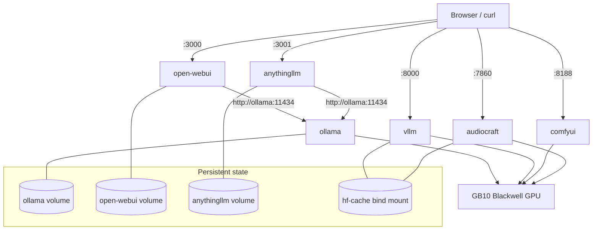

# Local AI on DGX OS 7 — 7-Day Hands-on Course (Lenovo ThinkStation PGX or any similar Nvidia GB10-based device)

[👉 Access the HTML version of the course](https://olivierhacon.github.io/local-ai-dgx-os7-nvidia-gb10-beginner-course/)

_Introduction · **read first**_

## Project overview

This is a hands-on, seven-day AI training course for the Lenovo ThinkStation PGX, NVIDIA DGX Spark, or any similar GB10-based device running DGX OS 7. Over the seven days you build a complete local AI stack with Docker — model inference, a chat UI, retrieval-augmented generation, an OpenAI-compatible API, image generation, and audio — roughly one capability per day.

## Table of contents

1. [Day 1 — Foundations & environment discovery](docs/day-01-foundations-environment-discovery.md)
2. [Day 2 — Docker, NVIDIA containers & the local AI stack](docs/day-02-docker-nvidia-containers-ai-stack.md)
3. [Day 3 — Ollama, local LLM inference & Open WebUI](docs/day-03-ollama-local-inference-open-webui.md)
4. [Day 4 — Documents, embeddings, RAG & AnythingLLM](docs/day-04-documents-embeddings-rag-anythingllm.md)
5. [Day 5 — vLLM, Hugging Face models, APIs & advanced inference](docs/day-05-vllm-hugging-face-models-apis.md)
6. [Day 6 — Image generation with ComfyUI, FLUX, workflows & upscaling](docs/day-06-image-generation-comfyui-flux.md)
7. [Day 7 — Audio/music generation, troubleshooting & recap](docs/day-07-audio-generation-wrap-up.md)

## Project files & where they live

Every file below is shown in full, in the day where it is used. Locations assume the project root `~/llm-stack/` on the DGX OS 7 host.

| File | Location in llm-stack | Used in |
| --- | --- | --- |
| `docker-compose.yml` | `~/llm-stack/docker-compose.yml` | Day 2 (full), referenced everywhere |
| `Dockerfile` (ComfyUI) | `~/llm-stack/comfyui-docker/Dockerfile` | Day 6 |
| `Dockerfile_audiocraft-docker` | `~/llm-stack/audiocraft-docker/Dockerfile` | Day 7 |
| `upload-kb.py` | `~/llm-stack/upload-kb.py` | Day 4 |
| `generate.py` | `~/llm-stack/audiocraft/scripts/generate.py` | Day 7 |
| `audiogen.py` | `~/llm-stack/audiocraft/scripts/audiogen.py` | Day 7 |
| `melody_conditioning.py` | `~/llm-stack/audiocraft/scripts/melody_conditioning.py` | Day 7 |
| `ui.py` | `~/llm-stack/audiocraft/scripts/ui.py` | Day 7 |
| `flux_schnell_realesrgan_workflow.json` | `~/llm-stack/comfyui/workflows/` | Day 6 |
| `sdxl_realesrgan_workflow.json` | `~/llm-stack/comfyui/workflows/` | Day 6 |
| `.env.example` / `.dockerignore` | `~/llm-stack/` | Day 6 (reference) |

## Global stack architecture

**Architecture**

The whole course builds a single multi-service stack. Some services run permanently (`ollama`, `open-webui`, `anythingllm`); the heavy ones (`vllm`, `comfyui`, `audiocraft`) use `restart: no` and are started on demand so they do not all fight over GPU memory at once.



The directory layout you build over the seven days:

**~/llm-stack/ (final layout)**

```text
~/llm-stack/
├── docker-compose.yml            # defines the whole stack
├── .env.example  .dockerignore
├── upload-kb.py                  # Day 4 — batch RAG ingestion
├── hf-cache/                     # shared Hugging Face cache (vllm, audiocraft)
├── vllm-models/                  # Day 5 — local vLLM model store
├── comfyui-docker/Dockerfile     # Day 6 — ComfyUI image
├── comfyui-src/                  # Day 6 — cloned ComfyUI source (bind-mounted to /comfyui)
├── comfyui/
│   ├── models/{checkpoints,vae,unet,clip,loras,controlnet,upscale_models}/
│   ├── output/  custom_nodes/  user/  workflows/
├── audiocraft-docker/Dockerfile  # Day 7 — AudioCraft image
└── audiocraft/
    ├── scripts/{generate.py,audiogen.py,melody_conditioning.py,ui.py}
    ├── output/                   # generated .wav files
    └── dataset/{audio/,metadata.jsonl}
```

## How to use this course

Each day is self-contained and progressive. Inside a day you will see colour-coded boxes:

- **Concept** — the idea explained before you touch the keyboard.
- **Hands-on** / **Command** — exactly what to type, with an explanation of *why*.
- **Expected output** — a realistic example of what you should see.
- **Checkpoint** — a checklist that confirms the day worked.
- **Common issue / Troubleshooting** — real errors and their fixes.
- **Deep dive** and **Full file** — extra depth and the verbatim source files.
- **Exercise** — practice to make it stick.

> [!CAUTION]
> **Warning — The one rule that governs everything**
>
> Almost everything runs **inside containers**. On DGX OS 7 you never `pip install` or `apt install` AI software on the host — the host stays clean and is managed by NVIDIA. Host commands are shown with a `$` prompt; commands that run inside a container are reached with `docker exec` or `docker compose run`.

Unless stated otherwise, run host commands from the project root: `cd ~/llm-stack`.
