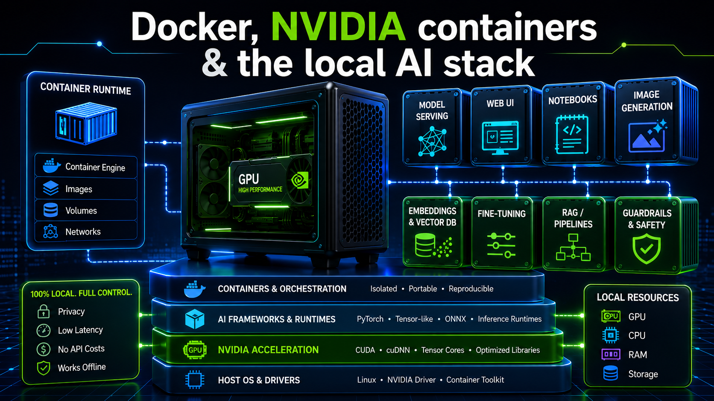

# Docker, NVIDIA containers & the local AI stack

_Day **2** of 7 · DGX OS 7 · GB10 Blackwell_

You now learn the vocabulary of containers and meet the blueprint of the whole course: the complete `docker-compose.yml`. Every later day adds or starts one of its services.



## Overview & objectives

> [!NOTE]
> **Learning objectives**
>
> - Define image, container, volume, bind mount, port mapping and container network.
> - Understand the `~/llm-stack` project layout and why it is organised this way.
> - Read the complete `docker-compose.yml` and know the role of every service.
> - Understand exactly how a Compose service is granted GPU access.
> - Master the daily Compose commands for starting, stopping, watching and debugging.

> [!NOTE]
> **Prerequisites**
>
> Day 1 complete: Docker active, NVIDIA runtime registered, NGC login working.

> [!NOTE]
> **Files involved**
>
> Introduced here: `~/llm-stack/docker-compose.yml` (shown in full).

## Docker concepts you must own

**Concept**

| Term | Meaning |
| --- | --- |
| **Image** | A read-only template: an OS plus software, frozen at a point in time. Example: `ollama/ollama:latest`. |
| **Container** | A running instance of an image — an isolated process with its own filesystem view. You can have many from one image. |
| **Volume** (named) | Docker-managed persistent storage living under `/var/lib/docker/volumes/`. Survives `docker compose down`. |
| **Bind mount** | A host directory mapped into a container, e.g. `~/llm-stack/comfyui/output:/comfyui/output`. You edit files on the host and the container sees them instantly. |
| **Port mapping** | `"3000:8080"` maps host port 3000 to container port 8080. Format is always **HOST:CONTAINER**. |
| **Container network** | Compose puts services on one private network where each service is reachable by its **service name** as hostname (e.g. `http://ollama:11434`). |
| **Docker Compose** | A tool that runs a multi-service stack from one declarative YAML file instead of many `docker run` commands. |

> [!NOTE]
> **Explanation**
>
> Why containers on DGX? They keep the NVIDIA-tuned host pristine, make every component reproducible, and let incompatible Python/CUDA stacks coexist (Ollama, vLLM, ComfyUI and AudioCraft all want different versions). NGC images add GB10-correct CUDA and drivers so you never fight compatibility on the host.

> [!IMPORTANT]
> **Deep dive — GPU access mechanics**
>
> **How a container reaches the GPU.** A normal container cannot see the GPU. Two equivalent mechanisms grant access:
>
> - In `docker run`: the flag `--gpus all` (used on Day 1).
> - In Compose: a `deploy.resources.reservations.devices` block requesting the `nvidia` driver. This is the modern method and the one used throughout `docker-compose.yml`.
>
> Both ask the NVIDIA Container Toolkit to inject the driver and devices into the container.

## The llm-stack project

> [!TIP]
> **Hands-on**
>
> Create the project root. Everything in the course lives here; the final compose file mounts `~/llm-stack/...` paths.
>
> ```bash
> $ mkdir -p ~/llm-stack && cd ~/llm-stack
> ```

> [!NOTE]
> **Explanation**
>
> Keeping one project directory means one `docker compose` context, one private network, and host-visible folders for models and outputs. You will create the per-service subfolders (`comfyui/`, `audiocraft/`, `hf-cache/`, …) on the day you first need them; the global tree is shown in the overview at the top of this course.

## The complete docker-compose.yml

> [!NOTE]
> **Reference**
>
> This is the heart of the stack. Read it once now for shape; each service is dissected on its own day. Services with `restart: no` are started on demand to share the GPU; the always-on trio is `ollama`, `open-webui`, `anythingllm`.

### Full file — `~/llm-stack/docker-compose.yml`

_206 lines_

Role: The single declarative definition of every service, volume, port, environment variable and GPU reservation.

```yaml
services:
  ollama:
    image: ollama/ollama:latest
    container_name: ollama
    restart: unless-stopped
    ports:
      - "11434:11434"
    volumes:
      - ollama:/root/.ollama
    deploy:
      resources:
        reservations:
          devices:
            - driver: nvidia
              count: all
              capabilities: [gpu]

  open-webui:
    image: ghcr.io/open-webui/open-webui:main
    container_name: open-webui
    restart: unless-stopped
    depends_on:
      - ollama
    ports:
      - "3000:8080"
    volumes:
      - open-webui:/app/backend/data
    ulimits:
      nofile:
        soft: 65536
        hard: 65536
    environment:
      - OLLAMA_BASE_URL=http://ollama:11434
      - RAG_EMBEDDING_MODEL=nomic-embed-text
      - RAG_EMBEDDING_ENGINE=ollama
      - CHUNK_SIZE=2000
      - CHUNK_OVERLAP=200

  anythingllm:
    image: mintplexlabs/anythingllm:latest
    container_name: anythingllm
    restart: unless-stopped
    ports:
      - "3001:3001"
    volumes:
      - anythingllm:/app/server/storage
    environment:
      - STORAGE_DIR=/app/server/storage
      - LLM_PROVIDER=ollama
      - OLLAMA_BASE_PATH=http://ollama:11434
      - EMBEDDING_ENGINE=ollama
      - EMBEDDING_BASE_PATH=http://ollama:11434
      - EMBEDDING_MODEL_PREF=nomic-embed-text:latest
      - VECTOR_DB=lancedb
    depends_on:
      - ollama

  comfyui:
    build:
      context: ./comfyui-docker
      dockerfile: Dockerfile
    container_name: comfyui
    restart: no
    platform: linux/arm64
    ports:
      - "8188:8188"
    ipc: host
    shm_size: 16gb
    environment:
      - NVIDIA_VISIBLE_DEVICES=all
      - NVIDIA_DRIVER_CAPABILITIES=compute,utility
    volumes:
      - ~/llm-stack/comfyui-src:/comfyui
      - ~/llm-stack/comfyui/models:/comfyui/models
      - ~/llm-stack/comfyui/output:/comfyui/output
      - ~/llm-stack/comfyui/custom_nodes:/comfyui/custom_nodes
      - ~/llm-stack/comfyui/user:/comfyui/user
    deploy:
      resources:
        reservations:
          devices:
            - driver: nvidia
              count: all
              capabilities: [gpu]
    command: >
      /bin/bash -c "
      cd /comfyui;
      python3 main.py --listen 0.0.0.0 --port 8188
        --highvram --use-flash-attention"
        
  vllm:
    image: nvcr.io/nvidia/vllm:25.10-py3
    container_name: vllm
    restart: no                          # à la demande
    ports:
      - "8000:8000"
    volumes:
      - ~/llm-stack/vllm-models:/models
      - ~/llm-stack/hf-cache:/root/.cache/huggingface   # ← cache HF ajouté
    ipc: host
    shm_size: 16gb
    environment:
      - NVIDIA_VISIBLE_DEVICES=all
      - HF_TOKEN=<REDACTED_HF_TOKEN>
      - HUGGING_FACE_HUB_TOKEN=<REDACTED_HF_TOKEN>            # ← duplicate HF token variable
      - HF_HUB_DISABLE_XET=1
      - HF_HUB_ENABLE_HF_TRANSFER=0
    deploy:
      resources:
        reservations:
          devices:
            - driver: nvidia
              count: all
              capabilities: [gpu]
    command: >
      python3 -m vllm.entrypoints.openai.api_server
        --model Qwen/Qwen2.5-7B-Instruct
        --host 0.0.0.0
        --port 8000
        --max-model-len 32768
        --gpu-memory-utilization 0.8

  audiocraft:
    build:
      context: ./audiocraft-docker
      dockerfile: Dockerfile
    container_name: audiocraft
    platform: linux/arm64
    ports:
      - "7860:7860"    # Gradio UI
    volumes:
      - ~/llm-stack/audiocraft/scripts:/workspace/scripts
      - ~/llm-stack/audiocraft/output:/workspace/output
      - ~/llm-stack/audiocraft/dataset:/workspace/dataset
      - ~/llm-stack/hf-cache:/root/.cache/huggingface
    ipc: host
    shm_size: 8gb
    environment:
      - NVIDIA_VISIBLE_DEVICES=all
      - HF_TOKEN=<REDACTED_HF_TOKEN>
    deploy:
      resources:
        reservations:
          devices:
            - driver: nvidia
              count: all
              capabilities: [gpu]
    restart: no    # started on demand like vLLM

volumes:
  ollama:
  open-webui:
  anythingllm:
```

Set the two Hugging Face tokens shown as `<REDACTED_HF_TOKEN>` to your own token (or move it to a `.env` file and never commit it). The `comfyui` and `audiocraft` services `build:` from local Dockerfiles you create on Days 6 and 7 respectively.

**Explanation**

| Service | Image | Port | Day | GPU |
| --- | --- | --- | --- | --- |
| `ollama` | `ollama/ollama:latest` | 11434 | 3 | always-on |
| `open-webui` | `ghcr.io/open-webui/open-webui:main` | 3000→8080 | 3–4 | via Ollama |
| `anythingllm` | `mintplexlabs/anythingllm:latest` | 3001 | 4 | via Ollama |
| `vllm` | `nvcr.io/nvidia/vllm:25.10-py3` | 8000 | 5 | on demand |
| `comfyui` (build) | `nvcr.io/nvidia/pytorch:25.10-py3` | 8188 | 6 | on demand |
| `audiocraft` (build) | `nvcr.io/nvidia/pytorch:25.10-py3` | 7860 | 7 | on demand |

> [!IMPORTANT]
> **Deep dive — Repeating patterns**
>
> Three patterns repeat across the file — learn them once:
>
> - **Named volumes** (`ollama:`, `open-webui:`, `anythingllm:` at the bottom) persist downloaded models and app data across restarts.
> - **The shared `hf-cache` bind mount** (`~/llm-stack/hf-cache:/root/.cache/huggingface`) is mounted into `vllm` and `audiocraft` so a Hugging Face model is downloaded once and reused everywhere.
> - **The GPU reservation block** appears in every GPU service — see the next section.

> [!WARNING]
> **Common issue — ComfyUI uses a pre-cloned source**
>
> The compose `comfyui` service mounts `~/llm-stack/comfyui-src:/comfyui` and simply runs `main.py`. That means you clone the ComfyUI source into `comfyui-src` once on the host (Day 6) rather than cloning at container start. The compose file uses a pre-cloned bind mount rather than cloning inside the container's `command`.

## GPU access in Compose, line by line

> [!TIP]
> **Hands-on**
>
> ```yaml
> deploy:
>   resources:
>     reservations:
>       devices:
>         - driver: nvidia    # use the NVIDIA Container Toolkit
>           count: all        # expose every GPU (here: the single GB10)
>           capabilities: [gpu]   # request GPU capability
> ```

> [!NOTE]
> **Explanation**
>
> This block is the Compose equivalent of `--gpus all`. It is mandatory for any service that must run on the GB10. Some services additionally set environment variables:
>
> - `NVIDIA_VISIBLE_DEVICES=all` — which GPUs the container may see.
> - `NVIDIA_DRIVER_CAPABILITIES=compute,utility` — which driver features are exposed (used by ComfyUI).
> - `ipc: host` and `shm_size` — give the container enough shared memory; on a 128 GB unified machine this avoids “bus error” crashes during heavy model loads.

> [!CAUTION]
> **Warning — deploy vs runtime: nvidia**
>
> Never combine the legacy `runtime: nvidia` with a `deploy` block in the same service — it produces `unknown or invalid runtime name: nvidia`. Use only the `deploy` block.

> [!TIP]
> **Hands-on**
>
> Quick GPU-images recap from Day 1 that you will reuse here:
>
> ```bash
> # NGC PyTorch is the base for the two custom builds
> $ docker pull nvcr.io/nvidia/pytorch:25.10-py3
> # vLLM official image
> $ docker pull nvcr.io/nvidia/vllm:25.10-py3
> # Community ARM64 images already used in compose
> $ docker pull ollama/ollama:latest
> $ docker pull ghcr.io/open-webui/open-webui:main
> $ docker pull mintplexlabs/anythingllm:latest
> ```

## Daily Compose commands

> [!TIP]
> **Hands-on**
>
> ```bash
> # --- lifecycle (run from ~/llm-stack) ---
> $ docker compose up -d                 # start everything in the background
> $ docker compose up -d ollama open-webui   # start only specific services
> $ docker compose down                  # stop all (data in volumes is kept)
> $ docker compose down -v               # stop AND delete volumes (erases models/data!)
> $ docker compose restart ollama        # restart one service
> $ docker compose pull && docker compose up -d   # update images
> ```
>
> ```bash
> # --- watch ---
> $ docker compose ps          # which services are up and their status
> $ docker compose logs -f     # follow logs of all services (Ctrl+C to stop)
> $ docker compose logs -f ollama   # follow one service
> $ docker stats               # live CPU / RAM / network per container
> $ docker system df -v        # disk used by images and volumes
> ```
>
> ```bash
> # --- interact with a running service ---
> $ docker exec -it ollama ollama list   # run a command inside a container
> $ docker exec -it ollama bash          # open a shell inside a container
> $ docker volume ls                     # list named volumes
> ```

> [!NOTE]
> **Explanation**
>
> Memorise `docker exec -it <container> <command>` — it is how you talk to Ollama, ComfyUI and the rest without ever installing anything on the host. `docker compose run --rm <service> <command>` is its on-demand cousin for the `restart: no` services (it starts a one-off container and removes it after).

> [!CAUTION]
> **Warning — Do not nuke your volumes**
>
> Never run `docker system prune -a --volumes` — it deletes everything, including downloaded models and your chats. Target what you want instead: `docker image prune -f` for dangling images, or `docker exec ollama ollama rm <model>` for a single model.

## Troubleshooting

**Troubleshooting**

| Symptom | Likely cause | Fix |
| --- | --- | --- |
| `exec format error` | x86 image on ARM64 | Use an ARM64 / NGC image; for builds, base on `nvcr.io/nvidia/pytorch:25.10-py3`. |
| `unknown or invalid runtime name: nvidia` | `runtime: nvidia` + `deploy` together | Remove `runtime: nvidia`, keep only the `deploy` block. |
| Container has no GPU | Missing `deploy` reservation | Add the GPU reservation block; verify with `docker exec <svc> nvidia-smi`. |
| port already in use | Another process holds the host port | Find it with `sudo lsof -i :3000` or change the host side of the mapping. |
| `permission denied` on Docker | User not in the docker group | `sudo usermod -aG docker $USER` then log out / in. |
| Volume data “disappeared” | Ran `down -v` or a global prune | Re-pull models; in future avoid `-v` and global prunes. |

> [!TIP]
> **Hands-on**
>
> Generic diagnostic flow when a service misbehaves:
>
> ```bash
> $ docker compose ps                 # is it Up?
> $ docker compose logs --tail=50 <svc>   # what did it say?
> $ docker exec <svc> nvidia-smi      # can it see the GPU?
> $ docker compose config | grep -A6 <svc>   # is the YAML what I think it is?
> ```

## Checkpoint & exercises

> [!TIP]
> **Checkpoint**
>
> - [ ] The project root ~/llm-stack exists — `ls -d ~/llm-stack`
> - [ ] docker-compose.yml is saved there — `ls ~/llm-stack/docker-compose.yml`
> - [ ] I can explain image vs container vs volume vs bind mount
> - [ ] I know what the deploy reservation block does
> - [ ] docker compose config validates the file — `docker compose config | head`
> - [ ] I can list/start/stop/log services from memory — `docker compose ps / up -d / down / logs -f`

> [!TIP]
> **Exercise**
>
> 1. Run `docker compose config` and confirm the file parses; pipe it through `grep -i image` to list every image.
> 2. Without scrolling up, name three services that are always-on and three that are on demand, and give the host port of each.
> 3. Explain in one sentence why the `hf-cache` bind mount appears in four different services.

> [!NOTE]
> **Recap**
>
> You can read the stack blueprint and you know how a service gets the GPU. **Day 3** starts the first always-on services — `ollama` and `open-webui` — and you talk to your first local LLM.
