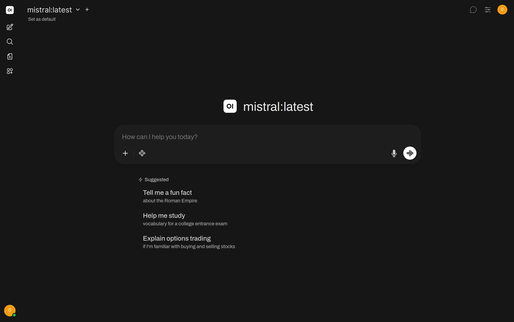
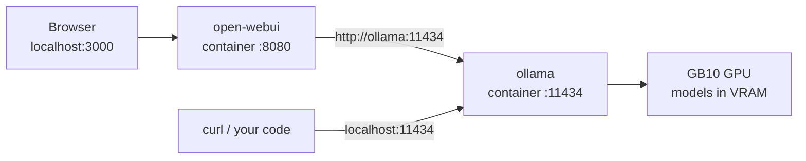

# Ollama, local LLM inference & Open WebUI

_Day **3** of 7 · DGX OS 7 · GB10 Blackwell_

Time to talk to a model. You start the two always-on services of the stack — `ollama` (the inference engine) and `open-webui` (the chat UI) — pull your first local LLM, and drive it from the CLI, the REST API and the browser.



## Overview & objectives

> [!NOTE]
> **Learning objectives**
>
> - Explain what an LLM is and what *local inference* means.
> - Distinguish a **model**, a **runtime** and a **UI**, and Ollama vs vLLM.
> - Start the `ollama` and `open-webui` services from the stack.
> - Pull, list, inspect and run models with `docker exec ollama ollama …`.
> - Call the Ollama REST API and its OpenAI-compatible endpoint with `curl`.
> - Create your Open WebUI account and confirm it sees Ollama.

> [!NOTE]
> **Prerequisites**
>
> Day 2 complete: you understand the compose file and the daily `docker compose` commands. The stack project lives in `~/llm-stack`.

> [!NOTE]
> **Files involved**
>
> Services used today (defined in `~/llm-stack/docker-compose.yml`): `ollama` and `open-webui`. No new files are written.

**Architecture**

The request path you are about to build:



Two services, one private Docker network. The browser talks to Open WebUI; Open WebUI talks to Ollama by its **service name** (`http://ollama:11434`); Ollama loads models onto the GB10.

## LLM concepts you must own

**Concept**

| Term | Meaning |
| --- | --- |
| **LLM** | A Large Language Model: a neural network trained to predict the next token. It powers chat, summarisation, code, Q&A — all by repeatedly predicting what comes next. |
| **Token** | The unit a model reads and writes — roughly ¾ of a word in English. "unbelievable" may be 3 tokens. You pay compute and context budget per token. |
| **Context length** | The maximum number of tokens (prompt + reply) the model can attend to at once, e.g. 8k, 32k, 128k. Exceed it and the oldest tokens are dropped. |
| **Inference** | Running a trained model to get an answer (as opposed to *training* it). **Local inference** = doing this on your own GB10, with no data leaving the machine. |
| **System vs user prompt** | The **system prompt** sets persistent behaviour ("You are a terse expert…"); the **user prompt** is the actual question. The model sees both. |

> [!NOTE]
> **Explanation**
>
> **Model vs runtime vs UI** — three layers people constantly confuse:
>
> - **Model**: the weights, e.g. `llama3.2`. Just data on disk.
> - **Runtime / engine**: the program that loads the weights into VRAM and computes answers — here `ollama` (and later `vllm`).
> - **UI**: the human front-end — here `open-webui`. It has no model of its own; it sends your text to the runtime over an API.

**Deep dive — Two runtimes, two jobs**

**Ollama vs vLLM** — both are inference runtimes, with different sweet spots:

|  | Ollama (Day 3) | vLLM (Day 5) |
| --- | --- | --- |
| Best for | Easy local chat, many models, quick swaps | High-throughput serving of one model |
| Model format | GGUF (quantised, small) | Hugging Face safetensors (usually full precision) |
| Loading | On demand, unloads when idle | Loads once at startup, stays resident |
| API | `/api/generate` + OpenAI-compatible `/v1` | OpenAI-compatible `/v1` |
| Concurrency | Modest | Excellent (continuous batching) |

Rule of thumb: **Ollama to explore**, **vLLM to serve**. You will run both on the same GB10.

## Start Ollama & pull your first model

> [!TIP]
> **Hands-on**
>
> From the project root, bring up the two always-on services. `ollama` has `restart: unless-stopped`, so it also returns after a reboot.
>
> ```bash
> $ cd ~/llm-stack
> $ docker compose up -d ollama open-webui
> ```
>
> Confirm both are `Up` and that Ollama actually sees the GPU:
>
> ```bash
> $ docker compose ps
> $ docker exec ollama nvidia-smi
> ```

> [!TIP]
> **Expected output**
>
> ```text
> NAME         IMAGE                              STATUS
> ollama       ollama/ollama:latest               Up 12 seconds
> open-webui   ghcr.io/open-webui/open-webui:main Up 10 seconds
>
> +-----------------------------------------------------------------+
> | GPU  Name        Memory-Usage                                   |
> |   0  GB10        512MiB / 98304MiB   <- ollama can reach the GPU |
> +-----------------------------------------------------------------+
> ```

> [!NOTE]
> **Explanation**
>
> All Ollama interaction goes **through the container** with `docker exec ollama ollama …`. You never install Ollama on the host. Models land in the named volume `ollama` at `/root/.ollama` inside the container, so they survive `docker compose down`.

> [!TIP]
> **Hands-on**
>
> Pick a model that fits comfortably in the ~130 GB of GPU-visible unified memory, then pull it:
>
> ```bash
> $ docker exec -it ollama ollama pull llama3.2
> ```
>
> Watch the GPU fill while it loads (in a second terminal):
>
> ```bash
> $ watch -n 2 nvidia-smi
> ```

**Concept**

| Model | Params · approx VRAM | Use it for |
| --- | --- | --- |
| `llama3.2` | 3B · ~2 GB | First steps, fast replies, the default of this course |
| `mistral` | 7B · ~4 GB | Strong all-rounder, great quality/size ratio |
| `llama3.3:70b` | 70B · ~42 GB | High-end reasoning; the GB10 has the memory for it |
| `qwen2.5:72b` | 72B · ~45 GB | Top-tier open model, multilingual |

> [!WARNING]
> **Common issue — Big models really do fit here**
>
> On the GB10 the GPU shares the machine's unified memory, so a 70B model is genuinely usable — something a 24 GB desktop card cannot do. Still leave headroom: if you plan to run `vllm` or `comfyui` at the same time, prefer the smaller models while learning.

## Drive the model: CLI & REST API

> [!TIP]
> **Hands-on**
>
> Manage models entirely through `docker exec`:
>
> ```bash
> ## List installed models
> $ docker exec ollama ollama list
>
> ## Detailed info (context size, parameters, quantisation)
> $ docker exec ollama ollama show llama3.2
>
> ## Which models are loaded in VRAM right now
> $ docker exec ollama ollama ps
>
> ## Remove a model to free disk space
> $ docker exec ollama ollama rm llama3.2
> ```

**Hands-on**

Chat interactively from the terminal — the fastest way to confirm a model answers:

```bash
$ docker exec -it ollama ollama run llama3.2
>>> Hello! In one sentence, what are you?
>>> /bye
```

> [!NOTE]
> **Explanation**
>
> The **first** reply takes a few seconds while the weights load into VRAM; later replies are near-instant as long as the model stays resident. `/bye` exits the chat.

> [!TIP]
> **Hands-on**
>
> Now hit the **REST API** from the host. Ollama publishes it on `localhost:11434`:
>
> ```bash
> $ curl http://localhost:11434/api/generate -d '{
>   "model": "llama3.2",
>   "prompt": "Say hello in 10 words or fewer.",
>   "stream": false
> }'
> ```

> [!TIP]
> **Expected output**
>
> ```text
> {"model":"llama3.2","response":"Hello there! How can I help you today?","done":true,...}
> ```

> [!IMPORTANT]
> **Deep dive — One engine, two APIs**
>
> Ollama also exposes an **OpenAI-compatible** API at `http://localhost:11434/v1`. Any tool or SDK that speaks OpenAI can point there and use your local models — no code changes beyond the base URL. This is exactly how later days wire Open WebUI, AnythingLLM and your own scripts in.
>
> ```bash
> ## List models the way integrations expect
> $ curl http://localhost:11434/api/tags | python3 -m json.tool
>
> ## OpenAI-style chat completion
> $ curl http://localhost:11434/v1/chat/completions -d '{
>   "model": "llama3.2",
>   "messages": [{"role":"user","content":"Hi"}]
> }'
> ```

## Open WebUI — the browser front-end

> [!TIP]
> **Hands-on**
>
> Open the UI. On the machine itself:
>
> ```bash
> http://localhost:3000
> ```
>
> From another machine on the LAN, find the ThinkStation's IP and use it:
>
> ```bash
> $ ip addr show | grep "inet " | grep -v 127.0.0.1
> ## then browse to  http://<that-IP>:3000
> ```

> [!NOTE]
> **Explanation**
>
> Recall the port mapping `"3000:8080"`: the browser uses **3000** on the host, but inside the container Open WebUI listens on **8080**. The first visit asks you to create a local **administrator account** — it stays on your machine, stored in the named volume `open-webui` at `/app/backend/data`.

> [!TIP]
> **Checkpoint**
>
> Confirm Open WebUI can reach Ollama: **Settings → Connections** should list `http://ollama:11434` with a green *Connected* status. Then pick `llama3.2` from the model dropdown and send a message.
>
> ```bash
> ## If the connection is red, inspect the UI logs:
> $ docker compose logs open-webui | tail -20
> ```

> [!NOTE]
> **Concept**
>
> Features you will lean on across the course:
>
> - **Multi-turn chat** with history, regeneration and branching.
> - **Model switching** — every model you `ollama pull` appears automatically, no restart.
> - **File upload** — drop PDFs/images into a chat (the foundation for RAG on Day 4).
> - **System prompts** — give a model a persistent role to specialise it.

> [!WARNING]
> **Common issue — New models appear by themselves**
>
> Open WebUI auto-detects models from Ollama. After any `docker exec ollama ollama pull <name>` the model shows up in the dropdown within seconds — you do not restart Open WebUI.

## Daily management

> [!TIP]
> **Hands-on**
>
> ```bash
> ## Start the two services (from ~/llm-stack)
> $ docker compose up -d ollama open-webui
>
> ## Stop cleanly — data in the named volumes is kept
> $ docker compose stop ollama open-webui
>
> ## Restart just one service
> $ docker compose restart open-webui
>
> ## Update to newer images
> $ docker compose pull ollama open-webui
> $ docker compose up -d ollama open-webui
> ```

> [!NOTE]
> **Explanation**
>
> Because both carry `restart: unless-stopped`, they come back on their own after a reboot — you do not relaunch them manually. Use `docker compose stop` (not `down`) when you only want to pause; `down` also removes the containers and network, though the named volumes — and therefore your models and chats — remain.

> [!TIP]
> **Hands-on**
>
> ```bash
> ## Live status
> $ docker compose ps
>
> ## Live CPU/RAM/network per container
> $ docker stats
>
> ## GPU load while a model answers
> $ watch -n 2 nvidia-smi
> ```

## Troubleshooting

**Troubleshooting**

| Symptom | Likely cause | Fix |
| --- | --- | --- |
| Open WebUI shows *Connection refused* right after start | Ollama needs a few seconds to be ready | Wait 10–15 s and reload. Confirm with `docker compose logs -f ollama`. |
| UI cannot reach Ollama (red in Settings → Connections) | Wrong base URL — using `localhost` instead of the service name | It must be `http://ollama:11434`. Inside Compose, `localhost` means the UI's own container, not Ollama. |
| `ollama` runs but is very slow / CPU-only | The GPU reservation block is missing | Check `docker exec ollama nvidia-smi` works; ensure the `deploy.resources.reservations` block is present (Day 2). |
| Port 3000 or 11434 already in use | Another process holds the host port | Find it with `sudo lsof -i :3000` and stop it, or remap the host side in the compose file. |
| A pull stalls at 0% | Network/registry hiccup | Re-run the same `ollama pull` — it resumes; check disk space with `df -h`. |

> [!NOTE]
> **Explanation**
>
> Order of diagnosis: is the **container** up (`docker compose ps`)? does the **engine** answer (`curl localhost:11434/api/tags`)? can the **UI** reach the engine (Settings → Connections)? Fix them in that order and most problems disappear.

## Checkpoint & exercises

> [!TIP]
> **Checkpoint**
>
> - [ ] Both services report `Up`. — `docker compose ps`
> - [ ] Ollama can see the GB10. — `docker exec ollama nvidia-smi`
> - [ ] At least one model is installed. — `docker exec ollama ollama list`
> - [ ] The REST API answers on the host. — `curl http://localhost:11434/api/tags`
> - [ ] Open WebUI loads and is *Connected* to Ollama at `http://ollama:11434`.

> [!TIP]
> **Exercise**
>
> 1. Pull a second model (e.g. `mistral`) and compare answer speed and quality with `llama3.2` on the same prompt in Open WebUI.
> 2. Use `ollama show llama3.2` to read its context length, then explain in your own words what would happen to a 50-page prompt.
> 3. Write a one-line `curl` call to the OpenAI-compatible `/v1/chat/completions` endpoint and confirm you get the same model to reply.
> 4. Give the model a system prompt in Open WebUI ("Answer only in bullet points") and verify the behaviour persists across turns.

> [!NOTE]
> **Recap**
>
> You started the engine and the UI, pulled a local model, and drove it three ways — CLI, REST API and browser. You also met the OpenAI-compatible endpoint that the rest of the stack relies on. Next, Day 4 turns this chat into a system that can answer from *your documents* using embeddings and RAG.
