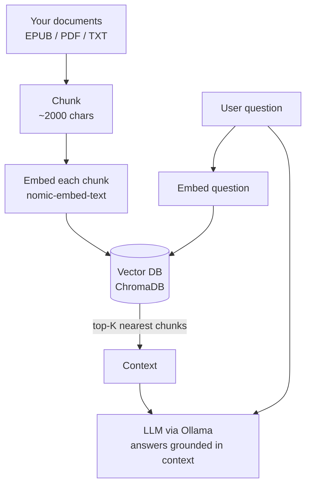

# Documents, embeddings, RAG & AnythingLLM

_Day **4** of 7 · DGX OS 7 · GB10 Blackwell_

You make the model answer from *your own documents*. You learn what embeddings and RAG really are, configure Open WebUI's document pipeline correctly, batch-upload a library with a real script, diagnose the vector store, and meet the dedicated `anythingllm` service.

<!-- Optional image slot:

-->

## Overview & objectives

> [!NOTE]
> **Learning objectives**
>
> - Explain embeddings, a vector database, and Retrieval-Augmented Generation (RAG).
> - Say when to use RAG.
> - Configure the embedding model and Documents settings in Open WebUI correctly.
> - Create a Knowledge Base, get its API key, and upload files via the API.
> - Understand why EPUB beats PDF here, and the empty-content / dimension bugs and their fixes.
> - Run the `upload-kb.py` batch uploader and tune retrieval for good answers.
> - Start the alternative `anythingllm` service and know when to prefer it.

> [!NOTE]
> **Prerequisites**
>
> Day 3 complete: `ollama` and `open-webui` running, at least one chat model installed, and Open WebUI connected to Ollama.

> [!NOTE]
> **Files involved**
>
> Used today: the `open-webui` and `anythingllm` services from `docker-compose.yml`, plus the helper script `~/llm-stack/upload-kb.py` (shown in full).

## RAG & embeddings — the concepts

**Concept**

| Term | Meaning |
| --- | --- |
| **Embedding** | A list of numbers (a vector) that captures the *meaning* of a chunk of text. Similar meanings sit close together in this space, regardless of exact words. |
| **Embedding model** | A small model that turns text into those vectors. Here `nomic-embed-text` (768 dimensions, 8192-token input). |
| **Chunk** | A document is split into pieces (e.g. ~2000 characters). Each chunk is embedded and stored separately so retrieval can pull just the relevant parts. |
| **Vector database** | Stores embeddings and finds the nearest vectors to a query. Open WebUI uses **ChromaDB** internally; AnythingLLM uses **LanceDB**. |
| **RAG** | Retrieval-Augmented Generation: embed the question, retrieve the closest chunks, paste them into the prompt as context, and let the LLM answer grounded in *your* text. |

**Architecture**

The RAG pipeline you are about to build:



> [!IMPORTANT]
> **Deep dive — Limits of document Q&A**
>
> **Limits of document Q&A:** RAG can only answer from what was retrieved. Bad chunking, a weak embedding model, or too few retrieved chunks all cause "I don't know" or hallucinated answers — which is why the configuration below matters so much.

## Embedding model & Documents configuration

> [!TIP]
> **Hands-on**
>
> RAG needs an embedding model. Pull it into Ollama so Open WebUI can call it locally:
>
> ```bash
> $ docker exec -it ollama ollama pull nomic-embed-text
> ```
>
> For French or mixed-language libraries, `bge-m3` (1024 dims) often retrieves better:
>
> ```bash
> $ docker exec -it ollama ollama pull bge-m3
> ```

> [!NOTE]
> **Explanation**
>
> The stack already points Open WebUI at the right defaults via environment variables in `docker-compose.yml` — `RAG_EMBEDDING_MODEL=nomic-embed-text`, `CHUNK_SIZE=2000` and `CHUNK_OVERLAP=200` — but you still set the **engine** in the UI so it uses Ollama rather than a bundled model.

**Hands-on**

In Open WebUI go to **Settings → Documents** and set:

**Concept**

| Setting | Value | Why |
| --- | --- | --- |
| Embedding Engine | `Ollama` | Use your local GPU embedding model, not a bundled CPU one |
| Embedding Model | `nomic-embed-text` | 768-dim, 8192-token context, fast on GB10 |
| Chunk Size | 2000 | Larger chunks keep more context per retrieval |
| Chunk Overlap | 200 | Avoids cutting sentences/ideas across chunk borders |
| Hybrid Search | On | Combines vector similarity with keyword (BM25) matching |
| BM25 Weight | 0.5 | Equal blend of semantic and keyword relevance |
| Top K | 8 | How many chunks to retrieve per question |
| Top K Reranker | 3 | Keep the 3 best after reranking — fed to the LLM |
| Relevance Threshold | 0 (then 0.3) | Start at 0 to verify retrieval, raise to 0.3 to cut noise |
| PDF Extract Images | Off | Image extraction triggers numpy errors here — leave off |

> [!WARNING]
> **Common issue — Pick the embedding model first**
>
> Changing the embedding model later is **not** free: existing vectors were stored at the old dimension. You must reset and reindex (see `d4-6`). Decide on `nomic-embed-text` (or `bge-m3`) *before* uploading a large library.

## Knowledge Base & the API key

> [!TIP]
> **Hands-on**
>
> Create a container for your documents: **Workspace → Knowledge → +**, give it a name. Open it and read the **UUID** from the browser URL — that is the `KB_ID` the API needs:
>
> ```bash
> http://localhost:3000/workspace/knowledge/<THIS-IS-THE-KB_ID>
> ```
>
> Get a personal API key under **Settings → Account → API Keys**. It looks like `sk-…` (Open WebUI) or a long JWT (AnythingLLM).

> [!CAUTION]
> **Security note — API keys and secrets**
>
> Treat the API key like a password. Never hard-code API keys, passwords, tokens, or other credentials directly in scripts — the key in `upload-kb.py` is shown here as `<REDACTED_API_KEY>`. Set your own via an environment variable or a local `.env` file excluded from Git, and never commit it.

> [!NOTE]
> **Explanation**
>
> With the `KB_ID` and an API key you can drive Open WebUI entirely over HTTP — upload files, process them, attach them to the Knowledge Base — which is exactly what the batch script automates.

## EPUB vs PDF & the batch uploader

> [!NOTE]
> **Concept**
>
> For RAG, **EPUB beats PDF**. EPUB is structured text, so extraction is clean. PDFs are layout-first: columns, headers and scanned pages produce garbled or empty text. If you have a choice, convert to EPUB before uploading.

> [!NOTE]
> **Explanation**
>
> Uploading one file to a Knowledge Base is actually **three** API steps, and order matters:
>
> 1. **Upload** the raw file → `POST /api/v1/files/` → returns a `file_id`.
> 2. **Process** it through retrieval (chunk + embed) → `POST /api/v1/retrieval/process/file`.
> 3. **Attach** it to the KB → `POST /api/v1/knowledge/{KB_ID}/file/add`.
>
> Skipping step 2 (or not waiting for extraction to finish) is the classic cause of the `EMPTY_CONTENT` error, especially for EPUBs. The script below polls until content is ready, then runs all three steps with delays.

### Full file — `~/llm-stack/upload-kb.py`

_150 lines_

Role: Batch-uploads every PDF/EPUB/TXT in a folder into an Open WebUI Knowledge Base, doing the upload → process → attach sequence with a content-ready poll and per-file status counters.

```python
#!/usr/bin/env python3

import sys
import time
import requests
from pathlib import Path

# ─── Configuration ───────────────────────────────────────────
API_KEY  = "<REDACTED_API_KEY>"
KB_ID    = "87d5e5cb-efc5-43be-9cda-f5a582b565ae"
URL      = "http://localhost:3000"
PDF_DIR  = Path("/home/user/documents/epub")
EXTS     = {".pdf", ".epub", ".txt"}
DELAY    = 60  # seconds to wait after upload — increase if errors
# ─────────────────────────────────────────────────────────────


MIME_TYPES = {
    ".pdf":  "application/pdf",
    ".epub": "application/epub+zip",
    ".txt":  "text/plain",
}

headers_auth = {"Authorization": f"Bearer {API_KEY}"}
headers_json = {
    "Authorization": f"Bearer {API_KEY}",
    "Content-Type": "application/json",
}

files_list = sorted([f for f in PDF_DIR.iterdir() if f.suffix.lower() in EXTS])

if not files_list:
    print(f"No files found in {PDF_DIR}")
    sys.exit(1)

print(f"📚 {len(files_list)} file(s) found\n")

success, empty, failed = 0, 0, 0

for i, filepath in enumerate(files_list, 1):
    ext = filepath.suffix.lower()
    mime = MIME_TYPES.get(ext, "application/octet-stream")
    print(f"[{i}/{len(files_list)}] {filepath.name}")

    # ── Step 1: Upload ─────────────────────────────────────
    try:
        with open(filepath, "rb") as f:
            r = requests.post(
                f"{URL}/api/v1/files/",
                headers=headers_auth,
                files={"file": (filepath.name, f, mime)},
                timeout=300,
            )
        r.raise_for_status()
        file_id = r.json().get("id")
        if not file_id:
            raise ValueError("No file_id")
        print(f"  ↑ Uploaded       ID: {file_id}")
    except Exception as e:
        print(f"  ❌ Upload failed: {e}")
        failed += 1
        print()
        continue

    # ── Smart wait — check that the content is ready ──
    print(f"  ⏳ Waiting for extraction...", end="", flush=True)
    wait_max = 60  # max seconds
    wait_step = 2
    waited = 0
    content_ready = False

    while waited < wait_max:
        time.sleep(wait_step)
        waited += wait_step
        try:
            r = requests.get(
                f"{URL}/api/v1/files/{file_id}",
                headers=headers_auth,
                timeout=10,
            )
            content = r.json().get("data", {}).get("content", "")
            if len(content.strip()) > 100:
                content_ready = True
                print(f" {waited}s ✓ ({len(content)} characters)")
                break
            else:
                print(".", end="", flush=True)
        except Exception:
            print(".", end="", flush=True)

    if not content_ready:
        print(f" timeout {wait_max}s — content not available")

    # ── Step 2: Process via retrieval ──────────────────────
    try:
        r = requests.post(
            f"{URL}/api/v1/retrieval/process/file",
            headers=headers_json,
            json={
                "file_id": file_id,
                "collection_name": f"file-{file_id}",
            },
            timeout=600,
        )
        body = r.json()
        if r.status_code == 200 and body.get("status"):
            chars = len(body.get("content", ""))
            print(f"  ⚙️  Processed      {chars} characters indexed")
        elif "EMPTY" in str(body):
            print(f"  ⚠️  Empty content — file skipped")
            empty += 1
            print()
            continue
        else:
            print(f"  ⚠️  Process ({r.status_code}): {body}")
    except Exception as e:
        print(f"  ⚠️  Process failed: {e}")

    # ── Step 3: Add to the Knowledge Base ──────────────────
    try:
        r = requests.post(
            f"{URL}/api/v1/knowledge/{KB_ID}/file/add",
            headers=headers_json,
            json={"file_id": file_id},
            timeout=120,
        )
        body = r.json()

        if "EMPTY_CONTENT" in str(body):
            print(f"  ⚠️  Empty content when adding to KB — skipped")
            empty += 1
        elif r.status_code == 200:
            nb = len(body.get("files", []))
            print(f"  ✅ Indexed        ({nb} file(s) in the KB)")
            success += 1
        else:
            print(f"  ❌ KB error ({r.status_code}): {body}")
            failed += 1

    except Exception as e:
        print(f"  ❌ KB error: {e}")
        failed += 1

    print()

print("━" * 40)
print(f"✅ Success : {success}")
print(f"⚠️  Empty   : {empty}  ← unreadable files")
print(f"❌ Failed  : {failed}")
print(f"📚 Total   : {len(files_list)}")
```

Adapt the configuration block before running: set `API_KEY` to your own key (shown redacted), `KB_ID` to your Knowledge Base UUID, and `PDF_DIR` to your documents folder (for example `/home/user/documents/epub`). **TODO: set your own PDF_DIR.** Raise `DELAY` if you still hit empty-content errors.

> [!TIP]
> **Hands-on**
>
> Run it from the host (it talks to Open WebUI on `localhost:3000`); `requests` is the only dependency:
>
> ```bash
> $ pip install --user requests
> $ python3 ~/llm-stack/upload-kb.py
> ```

> [!TIP]
> **Expected output**
>
> ```text
> 📚 23 file(s) found
>
> [1/23] book-one.epub
>   ↑ Uploaded       ID: 8b1c…
>   ⏳ Waiting for extraction... 6s ✓ (148213 characters)
>   ⚙️  Processed      148213 characters indexed
>   ✅ Indexed        (1 file(s) in the KB)
> ...
> ━━━━━━━━━━━━━━━━━━━━━━━━━━━━━━━━━━━━━━━━━━
> ✅ Success : 23
> ⚠️  Empty   : 0
> ❌ Failed  : 0
> 📚 Total   : 23
> ```

## Diagnosing with ChromaDB

> [!NOTE]
> **Explanation**
>
> Open WebUI keeps its vectors in a ChromaDB store inside the container at `/app/backend/data/vector_db`. When retrieval misbehaves, look there before blaming the model.

> [!WARNING]
> **Common issue — ChromaDB dimension error**
>
> **Dimension mismatch.** If you change the embedding model after indexing, you will see:
>
> ```text
> Expected embedding dimension 384, got 768
> ```
>
> Old vectors were stored at one size; the new model produces another. Fix it by resetting and reindexing:
>
> - In Open WebUI: **Settings → Documents → Reset Vector Storage**, then re-upload / **Reindex**.
> - Confirm the active model is the one you intend before re-uploading.

> [!WARNING]
> **Common issue — Knowledge endpoint returns null**
>
> **files: null.** A `GET /api/v1/knowledge/{KB_ID}` can return `files: null` even when files are attached (an Open WebUI v0.9.2 quirk). Use the dedicated files endpoint instead:
>
> ```bash
> $ curl -H "Authorization: Bearer <REDACTED_API_KEY>" \
>   http://localhost:3000/api/v1/knowledge/<KB_ID>/files | python3 -m json.tool
> ```

> [!TIP]
> **Hands-on**
>
> ```bash
> ## Peek inside the running container
> $ docker exec -it open-webui ls -la /app/backend/data/vector_db
>
> ## Follow logs while uploading to catch extraction errors live
> $ docker compose logs -f open-webui
> ```

## Querying & tuning RAG

> [!TIP]
> **Hands-on**
>
> Attach the Knowledge Base to a chat: type `#` in the message box and pick your KB, or assign it to a model in Workspace. Then ask a question whose answer is in your documents.

> [!NOTE]
> **Concept**
>
> Tuning levers, in the order to reach for them:
>
> - **Top K** too low → missing context; raise toward 8–10.
> - **Relevance Threshold** too high → good chunks filtered out; start at 0, then 0.3.
> - **Reranker Top K** controls how many survive to the prompt (3 is a good default).
> - **Hybrid Search** on with BM25 0.5 rescues exact-term questions vector search alone misses.

> [!WARNING]
> **Common issue — Pick a RAG-friendly model**
>
> Model choice matters for RAG quality. `llama3.2` and `llama3.3:70b` follow retrieved context well. Avoid `qwen3` *thinking* mode for RAG — it tends to reason past the context; if you must use it, append `/no_think` to suppress the chain.

> [!IMPORTANT]
> **Deep dive — Debug retrieval before generation**
>
> A good answer cites the chunk it used. If answers are vague, verify retrieval first (lower the threshold and check which chunks come back) before assuming the model is at fault — 9 times out of 10 the problem is retrieval, not generation.

## AnythingLLM — the dedicated alternative

> [!NOTE]
> **Explanation**
>
> Open WebUI bolts RAG onto a chat UI; **AnythingLLM** is built around documents and *workspaces* from the ground up. The stack ships it as a separate service so you can compare.

> [!TIP]
> **Hands-on**
>
> Start it and open the UI on its own port:
>
> ```bash
> $ cd ~/llm-stack
> $ docker compose up -d anythingllm
> ## then browse to  http://localhost:3001
> ```

**Concept**

| Compose setting | Value | Meaning |
| --- | --- | --- |
| image | `mintplexlabs/anythingllm:latest` | Official AnythingLLM image |
| port | `3001:3001` | Separate from Open WebUI's 3000 |
| `LLM_PROVIDER` | `ollama` | Reuses your local Ollama engine — no second model server |
| `VECTOR_DB` | `lancedb` | Bundled embedded vector DB (no extra service) |
| `EMBEDDING_MODEL_PREF` | `nomic-embed-text` | Same embedding model as Open WebUI, via Ollama |

> [!NOTE]
> **Explanation**
>
> Because it points at the same `ollama` service, AnythingLLM needs the Ollama base URL set to the service name (`http://ollama:11434`), exactly like Open WebUI. Create a **workspace**, drop documents in, and chat — vectors live in LanceDB inside the container's volume.

> [!IMPORTANT]
> **Deep dive — Open WebUI vs AnythingLLM**
>
> **Which to use?** Open WebUI if you want one tool for chat + light RAG + model management. AnythingLLM if documents are the main event: per-workspace isolation, document-centric UX, and easy switching of embedding/LLM providers. Both run side by side on the GB10.

## Troubleshooting & checkpoint

**Troubleshooting**

| Symptom | Likely cause | Fix |
| --- | --- | --- |
| `EMPTY_CONTENT` on EPUB upload | Attached to KB before extraction finished, or step 2 skipped | Use `upload-kb.py`'s flow: upload → poll → process → add; raise `DELAY`. |
| "Expected embedding dimension 384, got 768" | Embedding model changed after indexing | Reset Vector Storage, confirm model, reindex (`d4-6`). |
| KB query returns nothing useful | Threshold too high or Top K too low | Set Relevance Threshold 0, Top K 8, Hybrid Search on; verify retrieved chunks. |
| `GET /knowledge/{id}` shows `files: null` | Open WebUI v0.9.2 endpoint quirk | Query `/knowledge/{id}/files` instead. |
| PDF uploads index as empty | Scanned/columned PDF, or PDF image extraction on | Turn **PDF Extract Images Off**; convert to EPUB. |
| AnythingLLM can't reach the model | Ollama URL set to `localhost` | Use `http://ollama:11434` (service name on the Compose network). |

> [!TIP]
> **Checkpoint**
>
> - [ ] `nomic-embed-text` is installed in Ollama. — `docker exec ollama ollama list`
> - [ ] Documents settings use the Ollama engine with the values above.
> - [ ] A Knowledge Base exists and you have its UUID + API key.
> - [ ] Files are attached and visible via the files endpoint. — `curl .../api/v1/knowledge/<KB_ID>/files`
> - [ ] A question is answered from your documents in chat.

> [!TIP]
> **Exercise**
>
> 1. Upload the same book as both PDF and EPUB into two KBs and compare answer quality on identical questions.
> 2. Lower `Relevance Threshold` to 0 and then 0.3; observe how the retrieved chunks change.
> 3. Adapt `upload-kb.py`'s `PDF_DIR` and key, then batch-upload a small folder and read the success/empty/failed summary.
> 4. Spin up `anythingllm`, import one document, and write two sentences on which UI you prefer and why.

> [!NOTE]
> **Recap**
>
> You turned a generic chatbot into a system that answers from your own library: embeddings + a vector DB + retrieval feeding the LLM. You configured the pipeline, automated uploads, fixed the empty-content and dimension traps, and compared Open WebUI with AnythingLLM. Day 5 moves to `vllm` for high-throughput model serving over a clean OpenAI-compatible API.
