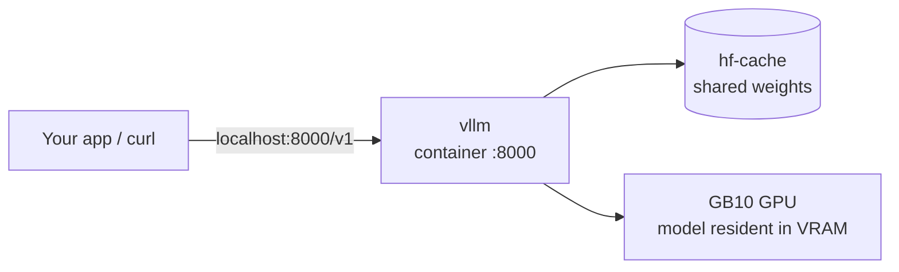

# vLLM, Hugging Face models, APIs & advanced inference

_Day **5** of 7 · DGX OS 7 · GB10 Blackwell_

You add a second, production-grade inference engine. `vllm` serves one Hugging Face model fast over an OpenAI-compatible API, pulling weights through a shared Hugging Face cache. You learn the GB10-specific settings that make it start cleanly.

<!-- Optional image slot:

-->

## Overview & objectives

> [!NOTE]
> **Learning objectives**
>
> - Explain what vLLM is and when to choose it over Ollama.
> - Understand the `vllm` service: image, ports, volumes, env and command.
> - Use a shared Hugging Face cache so models download once and are reused.
> - Call the OpenAI-compatible API at `localhost:8000/v1` from `curl` and Python.
> - Reason about VRAM, `--gpu-memory-utilization`, `--max-model-len` and quantization.
> - Fix the common GB10 issues: Xet download 403s, memory conflicts, slow first start.

> [!NOTE]
> **Prerequisites**
>
> Days 1–3 complete. You are comfortable with `docker compose`, the GPU reservation block, and the idea of an OpenAI-compatible endpoint (met on Day 3).

> [!NOTE]
> **Files involved**
>
> Used today: the `vllm` service in `~/llm-stack/docker-compose.yml`, and the shared cache directory `~/llm-stack/hf-cache`.

## vLLM vs Ollama — why a second engine

> [!NOTE]
> **Concept**
>
> Ollama is a friendly local runner: many models, on-demand loading, GGUF quantisation. **vLLM** is a serving engine built for throughput — it loads one model and keeps it hot, using *continuous batching* and `PagedAttention` to serve many concurrent requests efficiently.

**Deep dive — The trade-off**

|  | Ollama | vLLM |
| --- | --- | --- |
| Goal | Explore, swap models easily | Serve one model at scale |
| Weights | GGUF (quantised, small) | Hugging Face safetensors (full precision by default) |
| Loading | On demand; unloads when idle | Once at startup; stays resident |
| Concurrency | Modest | Excellent — many parallel requests |
| Memory | Small footprint | Pre-reserves a VRAM fraction up front |
| API | REST + OpenAI `/v1` | OpenAI `/v1` (drop-in) |

Both are OpenAI-compatible, so the same client code targets either by changing the base URL (`:11434/v1` for Ollama, `:8000/v1` for vLLM).

**Architecture**



## The vLLM service & the Hugging Face cache

> [!NOTE]
> **Reference**
>
> This is the `vllm` block from `docker-compose.yml` (the HF token is redacted):
>
> ```yaml
>   vllm:
>     image: nvcr.io/nvidia/vllm:25.10-py3
>     container_name: vllm
>     restart: no                          # on demand
>     ports:
>       - "8000:8000"
>     volumes:
>       - ~/llm-stack/vllm-models:/models
>       - ~/llm-stack/hf-cache:/root/.cache/huggingface   # shared HF cache
>     ipc: host
>     shm_size: 16gb
>     environment:
>       - NVIDIA_VISIBLE_DEVICES=all
>       - HF_TOKEN=<REDACTED_HF_TOKEN>
>       - HUGGING_FACE_HUB_TOKEN=<REDACTED_HF_TOKEN>
>       - HF_HUB_DISABLE_XET=1
>       - HF_HUB_ENABLE_HF_TRANSFER=0
>     deploy:
>       resources:
>         reservations:
>           devices:
>             - driver: nvidia
>               count: all
>               capabilities: [gpu]
>     command: >
>       python3 -m vllm.entrypoints.openai.api_server
>         --model Qwen/Qwen2.5-7B-Instruct
>         --host 0.0.0.0
>         --port 8000
>         --max-model-len 32768
>         --gpu-memory-utilization 0.8
> ```

> [!NOTE]
> **Explanation**
>
> Line by line, the parts that matter on the GB10:
>
> - `image: nvcr.io/nvidia/vllm:25.10-py3` — the NGC vLLM image. **25.10+** is required so the bundled CUDA understands the Blackwell `sm_121` architecture.
> - `restart: no` — vLLM is heavy and started *on demand*, unlike the always-on Ollama.
> - `ipc: host` + `shm_size: 16gb` — vLLM uses large shared-memory buffers; without this you get cryptic crashes.
> - `HF_TOKEN` / `HUGGING_FACE_HUB_TOKEN` — both set (some code reads one, some the other) so gated/large models download.
> - `HF_HUB_DISABLE_XET=1` + `HF_HUB_ENABLE_HF_TRANSFER=0` — disable the Xet CDN and the fast-transfer path, which return 403s from inside NGC containers on this setup.
> - `--model Qwen/Qwen2.5-7B-Instruct` — a strong, **public** model (no gating, unlike `meta-llama` which requires access approval).
> - `--max-model-len 32768` — cap the context window; larger needs more VRAM for the KV cache.
> - `--gpu-memory-utilization 0.8` — reserve 80% of GPU memory, leaving room for Ollama/ComfyUI.

> [!TIP]
> **Hands-on**
>
> Create the directories the service mounts, then start it:
>
> ```bash
> $ mkdir -p ~/llm-stack/vllm-models ~/llm-stack/hf-cache
> $ cd ~/llm-stack
> $ docker compose up -d vllm
> ```
>
> Watch it download and load (first run is slow — see below):
>
> ```bash
> $ docker compose logs -f vllm
> ```

> [!WARNING]
> **Common issue — One cache for the whole stack**
>
> The shared `hf-cache` is mounted by `vllm` and the audio service alike. Download a model once and every service reuses it from `~/llm-stack/hf-cache` — saving tens of GB and long waits.

## The OpenAI-compatible API

> [!TIP]
> **Hands-on**
>
> Once the logs show the server is up, list the served model:
>
> ```bash
> $ curl http://localhost:8000/v1/models | python3 -m json.tool
> ```
>
> Then run a chat completion — identical shape to OpenAI's API:
>
> ```bash
> $ curl http://localhost:8000/v1/chat/completions -d '{
>   "model": "Qwen/Qwen2.5-7B-Instruct",
>   "messages": [{"role":"user","content":"Explain VRAM in one sentence."}]
> }'
> ```

> [!TIP]
> **Expected output**
>
> ```text
> INFO: Started server process
> INFO: Uvicorn running on http://0.0.0.0:8000
> INFO: Application startup complete.
> ...
> {"id":"chatcmpl-…","model":"Qwen/Qwen2.5-7B-Instruct","choices":[{"message":{"role":"assistant","content":"VRAM is the GPU's dedicated memory …"}}]}
> ```

> [!IMPORTANT]
> **Deep dive — Use it from Python**
>
> Because it is OpenAI-compatible, the official `openai` Python client works unchanged — just point `base_url` at vLLM:
>
> ```python
> from openai import OpenAI
> client = OpenAI(base_url="http://localhost:8000/v1", api_key="not-needed")
> r = client.chat.completions.create(
>     model="Qwen/Qwen2.5-7B-Instruct",
>     messages=[{"role": "user", "content": "Hello"}],
> )
> print(r.choices[0].message.content)
> ```
>
> This is how you wire local inference into your own apps and scripts.

## VRAM, quantization & limits

**Concept**

| Lever | Effect |
| --- | --- |
| `--gpu-memory-utilization` | Fraction of GPU memory vLLM grabs at startup. Higher = bigger KV cache / more concurrency, but less left for other services. |
| `--max-model-len` | Maximum context tokens. Doubling it roughly doubles KV-cache VRAM. |
| Model size | 7B fits easily; 70B is feasible in the GB10's unified memory but leaves little headroom. |
| Quantization | Storing weights in fewer bits (e.g. AWQ/GPTQ) cuts VRAM and speeds load at a small quality cost — useful when running several engines at once. |

> [!NOTE]
> **Explanation**
>
> Why `0.8` and not the default `0.9`? With `ollama` and `comfyui` also resident (~15 GB), a 0.9 reservation triggers *"Free memory less than desired"* and vLLM refuses to start. `0.8` leaves room for the rest of the stack.

> [!TIP]
> **Hands-on**
>
> ```bash
> ## Watch total GPU memory while several engines run
> $ watch -n 2 nvidia-smi
>
> ## See exactly how much vLLM reserved at startup
> $ docker compose logs vllm | grep -i memory
> ```

> [!IMPORTANT]
> **Deep dive — Why the GB10 changes the maths**
>
> On a single 24 GB desktop GPU you would juggle one engine at a time. The GB10's large unified memory lets Ollama, vLLM and ComfyUI coexist — but the budget is still finite, so set `--gpu-memory-utilization` deliberately rather than leaving the default.

## Troubleshooting

**Troubleshooting**

| Symptom | Likely cause | Fix |
| --- | --- | --- |
| First start hangs for 30–60 min | Downloading ~15 GB of weights on first run | Normal. Watch `docker compose logs -f vllm`; later starts are 3–5 min from `hf-cache`. |
| 403 / Xet errors during download | Xet CDN blocked from NGC containers | Ensure `HF_HUB_DISABLE_XET=1` and `HF_HUB_ENABLE_HF_TRANSFER=0` are set. |
| "Free memory less than desired" at startup | `--gpu-memory-utilization` too high vs other resident engines | Lower to `0.8` (or stop `comfyui`/`vllm` peers); recheck `nvidia-smi`. |
| Gated-model 401/403 | Model requires access approval (e.g. `meta-llama`) | Request access on Hugging Face, or use a public model like `Qwen/Qwen2.5-7B-Instruct`. |
| Shared-memory / IPC crash | Missing `ipc: host` or small `shm_size` | Keep `ipc: host` and `shm_size: 16gb` in the service. |
| API reachable in container, not from browser/host | Server bound to localhost instead of 0.0.0.0 | Command already uses `--host 0.0.0.0`; confirm the `"8000:8000"` port mapping. |

## Checkpoint & exercises

> [!TIP]
> **Checkpoint**
>
> - [ ] The `vllm` service starts and logs *Application startup complete*. — `docker compose logs vllm`
> - [ ] `/v1/models` lists Qwen2.5-7B-Instruct. — `curl http://localhost:8000/v1/models`
> - [ ] A chat completion returns text. — `curl http://localhost:8000/v1/chat/completions -d '…'`
> - [ ] Weights are cached for reuse. — `ls ~/llm-stack/hf-cache`
> - [ ] GPU memory after start is roughly the 0.8 reservation. — `nvidia-smi`

> [!TIP]
> **Exercise**
>
> 1. Send the same prompt to Ollama (`:11434/v1`) and vLLM (`:8000/v1`) and compare latency for a single request, then for several in parallel.
> 2. Lower `--max-model-len` to 8192 in the compose command, restart, and observe the change in reserved VRAM via `nvidia-smi`.
> 3. Write a 10-line Python script using the `openai` client that asks vLLM three questions in a loop.
> 4. Stop `vllm` with `docker compose stop vllm` and confirm Ollama still serves — explain why the on-demand vs always-on distinction matters for VRAM.

> [!NOTE]
> **Recap**
>
> You now run two complementary engines: Ollama for easy exploration and vLLM for fast, concurrent serving of a Hugging Face model — both behind the same OpenAI API, sharing one HF cache. You also learned to budget GPU memory across engines. Day 6 switches modality entirely — generating images with ComfyUI and FLUX.
