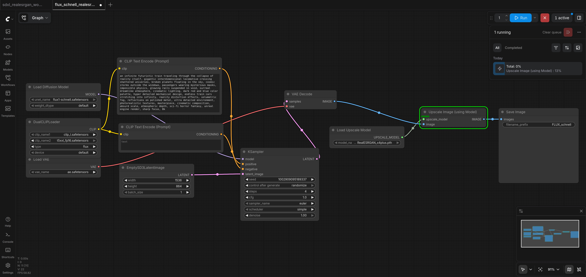

# Image generation with ComfyUI, FLUX, workflows & upscaling

_Day **6** of 7 · DGX OS 7 · GB10 Blackwell_

A complete change of modality. You build a custom `comfyui` image for the GB10, learn the node-graph way of thinking, generate your first images with SDXL and FLUX.1-schnell, and upscale them ×4 with Real-ESRGAN — all from reproducible workflow files.



## Overview & objectives

> [!NOTE]
> **Learning objectives**
>
> - Explain ComfyUI, workflows, checkpoints, prompts and negative prompts.
> - Understand the custom `comfyui` Dockerfile and why it pins versions and stubs torchaudio.
> - Read the `comfyui` compose service and its bind mounts.
> - Build, start and reach ComfyUI in the browser.
> - Download SDXL and FLUX.1-schnell models into the right folders.
> - Generate an image and tune the KSampler; upscale ×4 with Real-ESRGAN.
> - Load and persist workflow JSON files; install ComfyUI Manager.

> [!NOTE]
> **Prerequisites**
>
> Days 1–2 complete: Docker, the NVIDIA toolkit, the GPU reservation block and image building are familiar. Expect large downloads (FLUX is ~24 GB).

> [!NOTE]
> **Files involved**
>
> Files covered today: the ComfyUI `Dockerfile` and two workflows — `flux_schnell_realesrgan_workflow.json` and `sdxl_realesrgan_workflow.json`.

## ComfyUI concepts

**Concept**

| Term | Meaning |
| --- | --- |
| **ComfyUI** | A node-based UI for image generation: you wire boxes (load model → encode prompt → sample → decode → save) into a graph instead of filling a form. |
| **Workflow** | The graph itself, saveable as a JSON file. Sharing the JSON reproduces the exact pipeline on any machine. |
| **Checkpoint / model** | The image model's weights, e.g. SDXL (~7 GB) or FLUX.1-schnell (~24 GB across several files). |
| **Prompt / negative prompt** | Text describing what you want / what to avoid. FLUX-schnell ignores negative prompts; SDXL uses both. |
| **KSampler** | The node that runs diffusion: steps, CFG scale, sampler and scheduler live here. |
| **Upscaling** | Enlarging a generated image with a model (Real-ESRGAN) rather than naive stretching, recovering detail. |

> [!NOTE]
> **Explanation**
>
> The mental model — data flows left to right through nodes:
>
> **load** (checkpoint/UNet) → **encode** (prompt → conditioning) → **sample** (KSampler) → **decode** (VAE) → **upscale** (Real-ESRGAN) → **save** (image)

**Deep dive — Generate native, then upscale**

**Resolution strategy.** Never ask the model for 4K directly — it is slow and produces artefacts. Generate at the model's native resolution (1024×1024), then upscale ×4 with Real-ESRGAN to reach high resolution cleanly.

| Model | Native res · steps | Notes |
| --- | --- | --- |
| SD 1.5 (~2 GB) | 512–768 · 20–30 | Light, fast, lots of community models |
| SDXL (~7 GB) | 1024 · 20–25, CFG 7–8 | Use `dpmpp_2m` + `karras`; needs a negative prompt |
| FLUX.1-schnell (~24 GB) | 1024 · 4, CFG 1.0 | Distilled: 4 steps, simple scheduler, NO negative prompt, `EmptySD3LatentImage` |

## The comfyui directory

> [!TIP]
> **Hands-on**
>
> ComfyUI needs its source pre-cloned (the compose service bind-mounts it) plus host folders for models, output, custom nodes and user data:
>
> ```bash
> $ cd ~/llm-stack
> $ git clone https://github.com/comfyanonymous/ComfyUI comfyui-src
> $ mkdir -p comfyui/models/{checkpoints,vae,unet,clip,loras,controlnet,upscale_models}
> $ mkdir -p comfyui/output comfyui/custom_nodes comfyui/user
> $ mkdir -p comfyui-docker   # holds the Dockerfile below
> ```

> [!NOTE]
> **Explanation**
>
> Why pre-clone instead of cloning inside the container command? The `comfyui` service mounts `~/llm-stack/comfyui-src:/comfyui` so the code lives on the host — you can update it, inspect it and it survives rebuilds. Models live **outside** the source tree under `comfyui/models/` so they are never lost on a re-clone.
>
> - `models/checkpoints` — SDXL / SD1.5 checkpoints
> - `models/unet`, `models/clip`, `models/vae` — FLUX's split files
> - `models/upscale_models` — Real-ESRGAN weights
> - `output` — generated images appear here on the host
> - `user` — saved workflows and settings (must be mounted to persist)

## The ComfyUI Dockerfile

> [!NOTE]
> **Explanation**
>
> ComfyUI on the GB10 needs a custom image: the NGC PyTorch base for `sm_121` CUDA, system libs for image I/O, **pinned** `transformers==4.47.0` / `tokenizers==0.21.0` (newer versions break some nodes), and a one-line `torchaudio` stub because that package is absent from NGC 25.10 on aarch64 — harmless for image generation.

### Full file — `~/llm-stack/comfyui-docker/Dockerfile`

_24 lines_

Role: Builds the ComfyUI runtime: NGC PyTorch 25.10 base, system libraries (libgl1, glib, git, ffmpeg), the pinned ComfyUI Python dependencies, and a torchaudio stub to satisfy imports on aarch64.

```dockerfile
FROM nvcr.io/nvidia/pytorch:25.10-py3

ENV PIP_BREAK_SYSTEM_PACKAGES=1

RUN apt-get update && apt-get install -y \
    libgl1 libglib2.0-0 git ffmpeg \
    && rm -rf /var/lib/apt/lists/*

RUN python3 -m pip install --no-cache-dir \
    transformers==4.47.0 \
    huggingface_hub \
    tokenizers==0.21.0 \
    pyyaml regex fsspec filelock \
    einops torchsde safetensors aiohttp tqdm scipy pillow av kornia spandrel \
    pydantic-settings comfyui-frontend-package comfyui-workflow-templates \
    ultralytics toml alembic GitPython scikit-image piexif \
    comfy-aimdo

# torchaudio stub — missing from NGC 25.10 on aarch64, not critical for image generation
RUN python3 -c "import site; print(site.getsitepackages()[0])" | \
    xargs -I{} sh -c 'mkdir -p {}/torchaudio && echo "# stub" > {}/torchaudio/__init__.py'

EXPOSE 8188
```

The torchaudio stub writes an empty `torchaudio/__init__.py` into site-packages so imports succeed; image generation never uses audio. Version pins on transformers/tokenizers are deliberate — do not bump them blindly.

## The ComfyUI compose service

> [!NOTE]
> **Reference**
>
> The `comfyui` block from `docker-compose.yml`:
>
> ```yaml
>   comfyui:
>     build:
>       context: ./comfyui-docker
>       dockerfile: Dockerfile
>     container_name: comfyui
>     restart: no
>     platform: linux/arm64
>     ports:
>       - "8188:8188"
>     ipc: host
>     shm_size: 16gb
>     environment:
>       - NVIDIA_VISIBLE_DEVICES=all
>       - NVIDIA_DRIVER_CAPABILITIES=compute,utility
>     volumes:
>       - ~/llm-stack/comfyui-src:/comfyui
>       - ~/llm-stack/comfyui/models:/comfyui/models
>       - ~/llm-stack/comfyui/output:/comfyui/output
>       - ~/llm-stack/comfyui/custom_nodes:/comfyui/custom_nodes
>       - ~/llm-stack/comfyui/user:/comfyui/user
>     deploy:
>       resources:
>         reservations:
>           devices:
>             - driver: nvidia
>               count: all
>               capabilities: [gpu]
>     command: >
>       /bin/bash -c "
>       cd /comfyui;
>       python3 main.py --listen 0.0.0.0 --port 8188
>         --highvram --use-flash-attention"
> ```

> [!NOTE]
> **Explanation**
>
> - `build.context: ./comfyui-docker` — builds the custom image above.
> - `platform: linux/arm64` — the ThinkStation PGX is ARM64.
> - `ipc: host` + `shm_size: 16gb` — large shared buffers during sampling.
> - Five bind mounts: source, models, output, custom_nodes, user — all host-visible and persistent.
> - `--highvram` — keep models resident in the GB10's generous memory for speed.
> - `--use-flash-attention` — uses FlashAttention 2 / SDPA (FA3 is unsupported on `sm_121`).
> - `--listen 0.0.0.0` — reachable from your browser via the `"8188:8188"` mapping.

## Build & first start

> [!TIP]
> **Hands-on**
>
> ```bash
> $ cd ~/llm-stack
> $ docker compose build comfyui
> $ docker compose up -d comfyui
> $ docker compose logs -f comfyui
> ```

> [!NOTE]
> **Explanation**
>
> Open the UI at `http://localhost:8188`. Use plain **http** — typing `https://` yields an `SSL_ERROR` because ComfyUI serves unencrypted HTTP.

> [!WARNING]
> **Common issue — Harmless startup warnings**
>
> On startup you will see warnings about `torchaudio` missing, `comfy_kitchen`, `blake3` and `nodes_glsl`. These are **non-blocking** on the GB10 — the server still starts and generates images. Wait for the line announcing the server is listening on `8188`.

> [!TIP]
> **Checkpoint**
>
> ComfyUI is healthy when the browser shows the node canvas and `docker exec comfyui nvidia-smi` lists the GB10.

## Downloading models

> [!TIP]
> **Hands-on**
>
> **SDXL base** → `comfyui/models/checkpoints/`:
>
> ```bash
> $ cd ~/llm-stack/comfyui/models/checkpoints
> $ wget -O sd_xl_base_1.0.safetensors \
>   https://huggingface.co/stabilityai/stable-diffusion-xl-base-1.0/resolve/main/sd_xl_base_1.0.safetensors
> ```
>
> **FLUX.1-schnell** splits into four files across folders — UNet, VAE and two text encoders:
>
> ```bash
> ## unet
> $ cd ~/llm-stack/comfyui/models/unet
> $ wget https://huggingface.co/.../flux1-schnell.safetensors
>
> ## vae, clip_l and t5xxl_fp16 go to models/vae and models/clip respectively
> ## (ae.safetensors, clip_l.safetensors, t5xxl_fp16.safetensors)
> ```
>
> **Real-ESRGAN upscaler** (~67 MB) → `comfyui/models/upscale_models/`:
>
> ```bash
> $ cd ~/llm-stack/comfyui/models/upscale_models
> $ wget https://huggingface.co/.../RealESRGAN_x4plus.pth
> ```

> [!WARNING]
> **Common issue — Where to get the weights**
>
> The HuggingFace mirror for `RealESRGAN_x4plus.pth` is more reliable than the original GitHub release. Prefer **Real-ESRGAN** over plain ESRGAN — it handles photographic detail far better. **TODO: confirm the exact FLUX file URLs** for your chosen distribution.

> [!NOTE]
> **Explanation**
>
> ComfyUI discovers models by folder. A checkpoint dropped into `checkpoints/` appears in the `CheckpointLoaderSimple` node after a refresh; the upscaler appears in `UpscaleModelLoader`.

## First image & the KSampler

**Hands-on**

Start from the default SDXL graph (Load Checkpoint → two CLIP Text Encode → Empty Latent → KSampler → VAE Decode → Save Image). Set the KSampler and hit **Queue Prompt**:

**Concept**

| KSampler field | SDXL value | Meaning |
| --- | --- | --- |
| steps | 20–25 | Denoising iterations; more = slower, diminishing returns |
| cfg | 7–8 | How strictly to follow the prompt |
| sampler_name | `dpmpp_2m` | Reliable, high-quality sampler |
| scheduler | `karras` | Pairs well with dpmpp_2m |
| seed | any fixed number | Same seed + graph = same image (reproducible) |

> [!NOTE]
> **Explanation**
>
> The two CLIP Text Encode nodes are your **positive** and **negative** prompts. The Empty Latent Image sets the generation resolution — keep it at 1024×1024 for SDXL. Generated files land in `~/llm-stack/comfyui/output/` on the host.

> [!TIP]
> **Checkpoint**
>
> Success = an image appears in the Save Image node and a corresponding PNG shows up in `comfyui/output/`.

## Upscaling & reproducible workflows

> [!NOTE]
> **Explanation**
>
> Both workflows generate at 1024 then add `UpscaleModelLoader` (loading `RealESRGAN_x4plus.pth`) → `ImageUpscaleWithModel` before saving — giving a clean 4096×4096 result without asking the diffusion model for 4K directly.

### Full file — `~/llm-stack/comfyui/user/flux_schnell_realesrgan_workflow.json`

_192 lines_

Role: Complete FLUX.1-schnell workflow: UNETLoader(flux1-schnell) + DualCLIPLoader + VAELoader + EmptySD3LatentImage(1024) + KSampler(seed 42, 4 steps, euler, simple) + Real-ESRGAN ×4 upscale + SaveImage. No negative prompt, CFG 1.0 — the schnell recipe.

```json
{
  "last_node_id": 11,
  "last_link_id": 12,
  "nodes": [
    {
      "id": 1,
      "type": "UNETLoader",
      "pos": [50, 200],
      "size": {"0": 300, "1": 78},
      "flags": {},
      "order": 0,
      "mode": 0,
      "outputs": [
        {"name": "MODEL", "type": "MODEL", "links": [1], "slot_index": 0}
      ],
      "properties": {"Node name for S&R": "UNETLoader"},
      "widgets_values": ["flux1-schnell.safetensors", "default"]
    },
    {
      "id": 2,
      "type": "DualCLIPLoader",
      "pos": [50, 340],
      "size": {"0": 300, "1": 98},
      "flags": {},
      "order": 1,
      "mode": 0,
      "outputs": [
        {"name": "CLIP", "type": "CLIP", "links": [2], "slot_index": 0}
      ],
      "properties": {"Node name for S&R": "DualCLIPLoader"},
      "widgets_values": ["clip_l.safetensors", "t5xxl_fp16.safetensors", "flux"]
    },
    {
      "id": 3,
      "type": "VAELoader",
      "pos": [50, 490],
      "size": {"0": 300, "1": 58},
      "flags": {},
      "order": 2,
      "mode": 0,
      "outputs": [
        {"name": "VAE", "type": "VAE", "links": [8], "slot_index": 0}
      ],
      "properties": {"Node name for S&R": "VAELoader"},
      "widgets_values": ["ae.safetensors"]
    },
    {
      "id": 4,
      "type": "CLIPTextEncode",
      "pos": [420, 200],
      "size": {"0": 420, "1": 200},
      "flags": {},
      "order": 3,
      "mode": 0,
      "inputs": [{"name": "clip", "type": "CLIP", "link": 2}],
      "outputs": [
        {"name": "CONDITIONING", "type": "CONDITIONING", "links": [3], "slot_index": 0}
      ],
      "properties": {"Node name for S&R": "CLIPTextEncode"},
      "widgets_values": ["a photorealistic portrait of an astronaut floating in space, earth visible below, dramatic rim lighting, ultra detailed, shot on Hasselblad, cinematic"]
    },
    {
      "id": 5,
      "type": "EmptySD3LatentImage",
      "pos": [420, 450],
      "size": {"0": 300, "1": 106},
      "flags": {},
      "order": 4,
      "mode": 0,
      "outputs": [
        {"name": "LATENT", "type": "LATENT", "links": [5], "slot_index": 0}
      ],
      "properties": {"Node name for S&R": "EmptySD3LatentImage"},
      "widgets_values": [1024, 1024, 1]
    },
    {
      "id": 6,
      "type": "KSampler",
      "pos": [900, 300],
      "size": {"0": 315, "1": 262},
      "flags": {},
      "order": 5,
      "mode": 0,
      "inputs": [
        {"name": "model", "type": "MODEL", "link": 1},
        {"name": "positive", "type": "CONDITIONING", "link": 3},
        {"name": "negative", "type": "CONDITIONING", "link": 4},
        {"name": "latent_image", "type": "LATENT", "link": 5}
      ],
      "outputs": [
        {"name": "LATENT", "type": "LATENT", "links": [6], "slot_index": 0}
      ],
      "properties": {"Node name for S&R": "KSampler"},
      "widgets_values": [42, "randomize", 4, 1.0, "euler", "simple", 1.0]
    },
    {
      "id": 7,
      "type": "CLIPTextEncode",
      "pos": [420, 360],
      "size": {"0": 420, "1": 60},
      "flags": {},
      "order": 3,
      "mode": 0,
      "inputs": [{"name": "clip", "type": "CLIP", "link": 9}],
      "outputs": [
        {"name": "CONDITIONING", "type": "CONDITIONING", "links": [4], "slot_index": 0}
      ],
      "properties": {"Node name for S&R": "CLIPTextEncode"},
      "widgets_values": [""]
    },
    {
      "id": 8,
      "type": "VAEDecode",
      "pos": [1270, 300],
      "size": {"0": 210, "1": 46},
      "flags": {},
      "order": 6,
      "mode": 0,
      "inputs": [
        {"name": "samples", "type": "LATENT", "link": 6},
        {"name": "vae", "type": "VAE", "link": 8}
      ],
      "outputs": [
        {"name": "IMAGE", "type": "IMAGE", "links": [10], "slot_index": 0}
      ],
      "properties": {"Node name for S&R": "VAEDecode"}
    },
    {
      "id": 9,
      "type": "UpscaleModelLoader",
      "pos": [1270, 420],
      "size": {"0": 300, "1": 58},
      "flags": {},
      "order": 7,
      "mode": 0,
      "outputs": [
        {"name": "UPSCALE_MODEL", "type": "UPSCALE_MODEL", "links": [11], "slot_index": 0}
      ],
      "properties": {"Node name for S&R": "UpscaleModelLoader"},
      "widgets_values": ["RealESRGAN_x4plus.pth"]
    },
    {
      "id": 10,
      "type": "ImageUpscaleWithModel",
      "pos": [1630, 300],
      "size": {"0": 260, "1": 46},
      "flags": {},
      "order": 8,
      "mode": 0,
      "inputs": [
        {"name": "upscale_model", "type": "UPSCALE_MODEL", "link": 11},
        {"name": "image", "type": "IMAGE", "link": 10}
      ],
      "outputs": [
        {"name": "IMAGE", "type": "IMAGE", "links": [12], "slot_index": 0}
      ],
      "properties": {"Node name for S&R": "ImageUpscaleWithModel"}
    },
    {
      "id": 11,
      "type": "SaveImage",
      "pos": [1940, 300],
      "size": {"0": 320, "1": 58},
      "flags": {},
      "order": 9,
      "mode": 0,
      "inputs": [{"name": "images", "type": "IMAGE", "link": 12}],
      "properties": {"Node name for S&R": "SaveImage"},
      "widgets_values": ["FLUX_schnell"]
    }
  ],
  "links": [
    [1, 1, 0, 6, 0, "MODEL"],
    [2, 2, 0, 4, 0, "CLIP"],
    [3, 4, 0, 6, 1, "CONDITIONING"],
    [4, 7, 0, 6, 2, "CONDITIONING"],
    [5, 5, 0, 6, 3, "LATENT"],
    [6, 6, 0, 8, 0, "LATENT"],
    [8, 3, 0, 8, 1, "VAE"],
    [9, 2, 0, 7, 0, "CLIP"],
    [10, 8, 0, 10, 1, "IMAGE"],
    [11, 9, 0, 10, 0, "UPSCALE_MODEL"],
    [12, 10, 0, 11, 0, "IMAGE"]
  ],
  "groups": [],
  "config": {},
  "extra": {
    "ds": {"scale": 0.65, "offset": [0, 0]}
  },
  "version": 0.4
}
```

Load by dragging this JSON onto the ComfyUI canvas. FLUX-schnell needs only 4 steps and CFG 1.0 and ignores negative prompts. The first run JIT-compiles for sm_121 (~238 s); later images are ~20 s.

### Full file — `~/llm-stack/comfyui/user/sdxl_realesrgan_workflow.json`

_152 lines_

Role: Complete SDXL workflow: CheckpointLoaderSimple(sd_xl_base_1.0) + positive/negative CLIPTextEncode + EmptyLatentImage(1024) + KSampler(20 steps, CFG 8, euler, normal) + Real-ESRGAN ×4 upscale + SaveImage.

```json
{
  "last_node_id": 9,
  "last_link_id": 9,
  "nodes": [
    {
      "id": 1,
      "type": "CheckpointLoaderSimple",
      "pos": [50, 350],
      "size": {"0": 300, "1": 98},
      "flags": {},
      "order": 0,
      "mode": 0,
      "outputs": [
        {"name": "MODEL", "type": "MODEL", "links": [1], "slot_index": 0},
        {"name": "CLIP", "type": "CLIP", "links": [2, 3], "slot_index": 1},
        {"name": "VAE", "type": "VAE", "links": [8], "slot_index": 2}
      ],
      "properties": {"Node name for S&R": "CheckpointLoaderSimple"},
      "widgets_values": ["sdxl_base_1.0.safetensors"]
    },
    {
      "id": 2,
      "type": "CLIPTextEncode",
      "pos": [400, 180],
      "size": {"0": 380, "1": 180},
      "flags": {},
      "order": 1,
      "mode": 0,
      "inputs": [{"name": "clip", "type": "CLIP", "link": 2}],
      "outputs": [{"name": "CONDITIONING", "type": "CONDITIONING", "links": [4], "slot_index": 0}],
      "properties": {"Node name for S&R": "CLIPTextEncode"},
      "widgets_values": ["a photorealistic portrait of an astronaut on the moon, dramatic lighting, earth visible in background, highly detailed, 8k, cinematic"]
    },
    {
      "id": 3,
      "type": "CLIPTextEncode",
      "pos": [400, 400],
      "size": {"0": 380, "1": 120},
      "flags": {},
      "order": 2,
      "mode": 0,
      "inputs": [{"name": "clip", "type": "CLIP", "link": 3}],
      "outputs": [{"name": "CONDITIONING", "type": "CONDITIONING", "links": [5], "slot_index": 0}],
      "properties": {"Node name for S&R": "CLIPTextEncode"},
      "widgets_values": ["text, watermark, blurry, low quality, deformed, ugly"]
    },
    {
      "id": 4,
      "type": "EmptyLatentImage",
      "pos": [400, 560],
      "size": {"0": 300, "1": 106},
      "flags": {},
      "order": 3,
      "mode": 0,
      "outputs": [{"name": "LATENT", "type": "LATENT", "links": [6], "slot_index": 0}],
      "properties": {"Node name for S&R": "EmptyLatentImage"},
      "widgets_values": [1024, 1024, 1]
    },
    {
      "id": 5,
      "type": "KSampler",
      "pos": [820, 350],
      "size": {"0": 315, "1": 262},
      "flags": {},
      "order": 4,
      "mode": 0,
      "inputs": [
        {"name": "model", "type": "MODEL", "link": 1},
        {"name": "positive", "type": "CONDITIONING", "link": 4},
        {"name": "negative", "type": "CONDITIONING", "link": 5},
        {"name": "latent_image", "type": "LATENT", "link": 6}
      ],
      "outputs": [{"name": "LATENT", "type": "LATENT", "links": [7], "slot_index": 0}],
      "properties": {"Node name for S&R": "KSampler"},
      "widgets_values": [286461072923471, "randomize", 20, 8.0, "euler", "normal", 1.0]
    },
    {
      "id": 6,
      "type": "VAEDecode",
      "pos": [1180, 350],
      "size": {"0": 210, "1": 46},
      "flags": {},
      "order": 5,
      "mode": 0,
      "inputs": [
        {"name": "samples", "type": "LATENT", "link": 7},
        {"name": "vae", "type": "VAE", "link": 8}
      ],
      "outputs": [{"name": "IMAGE", "type": "IMAGE", "links": [9], "slot_index": 0}],
      "properties": {"Node name for S&R": "VAEDecode"}
    },
    {
      "id": 7,
      "type": "UpscaleModelLoader",
      "pos": [1180, 480],
      "size": {"0": 300, "1": 58},
      "flags": {},
      "order": 6,
      "mode": 0,
      "outputs": [{"name": "UPSCALE_MODEL", "type": "UPSCALE_MODEL", "links": [10], "slot_index": 0}],
      "properties": {"Node name for S&R": "UpscaleModelLoader"},
      "widgets_values": ["RealESRGAN_x4plus.pth"]
    },
    {
      "id": 8,
      "type": "ImageUpscaleWithModel",
      "pos": [1530, 350],
      "size": {"0": 260, "1": 46},
      "flags": {},
      "order": 7,
      "mode": 0,
      "inputs": [
        {"name": "upscale_model", "type": "UPSCALE_MODEL", "link": 10},
        {"name": "image", "type": "IMAGE", "link": 9}
      ],
      "outputs": [{"name": "IMAGE", "type": "IMAGE", "links": [11], "slot_index": 0}],
      "properties": {"Node name for S&R": "ImageUpscaleWithModel"}
    },
    {
      "id": 9,
      "type": "SaveImage",
      "pos": [1840, 350],
      "size": {"0": 320, "1": 58},
      "flags": {},
      "order": 8,
      "mode": 0,
      "inputs": [{"name": "images", "type": "IMAGE", "link": 11}],
      "properties": {"Node name for S&R": "SaveImage"},
      "widgets_values": ["ComfyUI"]
    }
  ],
  "links": [
    [1, 1, 0, 5, 0, "MODEL"],
    [2, 1, 1, 2, 0, "CLIP"],
    [3, 1, 1, 3, 0, "CLIP"],
    [4, 2, 0, 5, 1, "CONDITIONING"],
    [5, 3, 0, 5, 2, "CONDITIONING"],
    [6, 4, 0, 5, 3, "LATENT"],
    [7, 5, 0, 6, 0, "LATENT"],
    [8, 1, 2, 6, 1, "VAE"],
    [9, 6, 0, 8, 1, "IMAGE"],
    [10, 7, 0, 8, 0, "UPSCALE_MODEL"],
    [11, 8, 0, 9, 0, "IMAGE"]
  ],
  "groups": [],
  "config": {},
  "extra": {
    "ds": {"scale": 0.7, "offset": [0, 0]}
  },
  "version": 0.4
}
```

Drag onto the canvas to load. Edit the two CLIPTextEncode nodes for your positive and negative prompts, then Queue Prompt.

> [!WARNING]
> **Common issue — Loading & persisting workflows**
>
> In ComfyUI v0.20 the menu "Load" entry can fail to open workflows — **drag-and-drop the JSON onto the canvas** instead. And mount `comfyui/user` (the compose service does) or your saved workflows vanish on restart.

## ComfyUI Manager & troubleshooting

> [!TIP]
> **Hands-on**
>
> Install **ComfyUI Manager** for one-click custom nodes by cloning into `custom_nodes/`:
>
> ```bash
> $ cd ~/llm-stack/comfyui/custom_nodes
> $ git clone https://github.com/ltdrdata/ComfyUI-Manager
> $ docker compose restart comfyui
> ```

**Troubleshooting**

| Symptom | Likely cause | Fix |
| --- | --- | --- |
| `SSL_ERROR` in the browser | Used `https://` | Use `http://localhost:8188` — ComfyUI serves plain HTTP. |
| Model not listed in a loader node | Wrong folder or not refreshed | Put it in the matching `models/<type>/` folder; click refresh or reload the page. |
| First FLUX image takes ~4 minutes | JIT compile for `sm_121` on first run | Normal — subsequent images are ~20 s. Keep `--highvram` so the model stays resident. |
| Startup warnings (torchaudio, blake3, glsl) | Optional components absent on aarch64 | Non-blocking — wait for the listening message; generation works. |
| Saved workflow lost after restart | `comfyui/user` not mounted | Ensure the user bind mount is present (it is in the compose file). |
| Out of memory on huge images | Asking the model for 4K directly | Generate at 1024 and upscale ×4 with Real-ESRGAN instead. |

## Checkpoint & exercises

> [!TIP]
> **Checkpoint**
>
> - [ ] The custom image builds and the service starts. — `docker compose up -d comfyui`
> - [ ] The canvas loads at `http://localhost:8188`.
> - [ ] At least one checkpoint and the Real-ESRGAN upscaler are in place. — `ls comfyui/models/checkpoints comfyui/models/upscale_models`
> - [ ] An SDXL image generates and lands in `comfyui/output/`.
> - [ ] A provided workflow JSON loads via drag-and-drop and runs end-to-end with upscaling.

> [!TIP]
> **Exercise**
>
> 1. Generate the same prompt in SDXL and FLUX-schnell; compare quality, step count and time.
> 2. Take one 1024 image and run it through the Real-ESRGAN node; compare file dimensions before/after.
> 3. Fix a seed in the KSampler, generate twice, and confirm the images are identical.
> 4. Edit the negative prompt in the SDXL workflow and describe how the output changes.

> [!NOTE]
> **Recap**
>
> You stood up a GB10-correct ComfyUI, learned the node-graph model, generated with SDXL and FLUX-schnell, and upscaled ×4 with Real-ESRGAN from reproducible workflow files. Day 7 closes the course with audio/music generation and a master troubleshooting reference.
