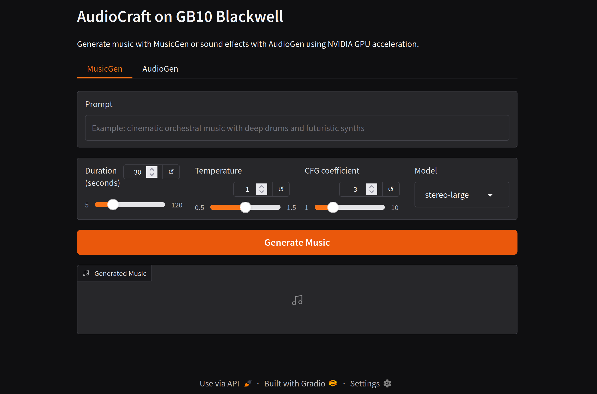

# Audio/music generation, troubleshooting & recap

_Day **7** of 7 · DGX OS 7 · GB10 Blackwell_

The final day. You generate music and sound with Meta's AudioCraft on the GB10, consolidate every issue from the week into one master troubleshooting reference, and map out where to go next.



## Overview & objectives

> [!NOTE]
> **Learning objectives**
>
> - Explain MusicGen, AudioGen and EnCodec, and the torchaudio stub problem on this hardware.
> - Build the AudioCraft image and understand its on-disk torchaudio/xformers stubs.
> - Generate music with `generate.py`, sound effects with `audiogen.py`, and melody-conditioned music with `melody_conditioning.py`.
> - Use the Gradio `ui.py` and the shell aliases.
> - Use one master troubleshooting table covering the whole stack.
> - Know concrete next steps after the course.

> [!NOTE]
> **Prerequisites**
>
> Days 1–6 complete: image building, the GPU reservation block, and the shared `hf-cache`.

> [!NOTE]
> **Files involved**
>
> Files covered today: the AudioCraft `Dockerfile`, `generate.py`, `audiogen.py`, `melody_conditioning.py` and `ui.py`.

## AudioCraft concepts

**Concept**

| Model | What it does |
| --- | --- |
| **MusicGen** | Text-to-music. Sizes: `small` (300M), `medium` (1.5B), `large` (3.3B) and `stereo-large`. |
| **AudioGen** | Text-to-sound-effects (rain, forest, crowd) rather than musical structure. |
| **EnCodec** | The neural audio codec underneath — compresses/decompresses audio into tokens the models work with. |
| **Melody conditioning** | MusicGen-melody can follow a reference melody (chroma) in addition to text. |

> [!NOTE]
> **Explanation**
>
> All these models are loaded through the `audiocraft` library on top of PyTorch. Output is WAV written to `~/llm-stack/audiocraft/output/` on the host. Generation runs on the GB10 like every other GPU workload in the stack.

> [!IMPORTANT]
> **Deep dive — Why audio is the trickiest modality here**
>
> **The torchaudio problem.** AudioCraft expects `torchaudio`, but NGC 25.10 on aarch64 does not ship it, and `torchaudio.transforms.Loudness` is missing even from the stub. Two fixes appear throughout: the image builds a functional on-disk torchaudio stub (load/save via `soundfile`, resample via `scipy`, spectrograms via `torch.stft`), and each script adds a small `_Loudness` RMS patch at the top before importing AudioCraft.

## The audiocraft directory

> [!TIP]
> **Hands-on**
>
> ```bash
> $ cd ~/llm-stack
> $ mkdir -p audiocraft-docker          # holds the Dockerfile
> $ mkdir -p audiocraft/scripts audiocraft/output audiocraft/dataset
> ```

> [!NOTE]
> **Explanation**
>
> - `audiocraft-docker/` — the build context for the custom image.
> - `audiocraft/scripts/` — `generate.py`, `audiogen.py`, `melody_conditioning.py`, `ui.py` (mounted to `/workspace/scripts`).
> - `audiocraft/output/` — generated WAV files appear here on the host.
> - `audiocraft/dataset/` — audio + `metadata.jsonl`.

## The AudioCraft Dockerfile

> [!NOTE]
> **Explanation**
>
> This is the most involved image of the course — four build iterations of hard-won fixes. It installs audio system libraries, builds a **re-executable** torchaudio stub, provides an `xformers` stub via a `.pth` file, and installs `audiocraft --no-deps` plus carefully chosen dependencies so nothing drags in an incompatible torch.

### Full file — `~/llm-stack/audiocraft-docker/Dockerfile`

_305 lines_

Role: Builds the AudioCraft runtime on NGC PyTorch 25.10 (aarch64): audio libs (libav*, libsndfile, sox), an on-disk torchaudio stub implementing load/save/resample/spectrogram, an xformers stub, and audiocraft + encodec + demucs installed with --no-deps to protect the NGC torch build.

```dockerfile
FROM nvcr.io/nvidia/pytorch:25.10-py3
ENV PIP_BREAK_SYSTEM_PACKAGES=1
ENV PYTHONUNBUFFERED=1

# ── System dependencies ────────────────────────────────────────────────────────
RUN apt-get update && apt-get install -y \
    git ffmpeg \
    libavformat-dev libavcodec-dev libavdevice-dev \
    libavutil-dev libavfilter-dev libswscale-dev libswresample-dev \
    libsndfile1 libsox-dev sox \
    pkg-config build-essential cmake ninja-build \
    && rm -rf /var/lib/apt/lists/*

# ── Python dependencies for the stubs ─────────────────────────────────────────
RUN pip install --no-cache-dir soundfile scipy

# ── torchaudio stub (real on-disk package) ─────────────────────────────────────
# Functions in a separate script so it can be re-invoked after pip install.
# Reason: openunmix and encodec depend on torchaudio directly; pip overwrites
# our on-disk stub even with --no-deps on the parent if openunmix is installed
# normally. We isolate the stub build in a reusable script and re-run it after
# every risky pip install.
RUN python3 - << 'PYEOF'
import os

SITE  = "/usr/local/lib/python3.12/dist-packages"

# The stub build script, stored on disk so it can be re-executed.
BUILDER = f"{SITE}/_build_torchaudio_stub.py"

script = r'''
import os, pathlib, shutil

SITE  = "/usr/local/lib/python3.12/dist-packages"
PKG   = f"{SITE}/torchaudio"
FUNC  = f"{PKG}/functional"
TRANS = f"{PKG}/transforms"
BACK  = f"{PKG}/backend"

# ── Purge any existing torchaudio wheel ────────────────────────────────────
p = pathlib.Path(SITE)
for dist in p.glob("torchaudio-*.dist-info"):
    shutil.rmtree(dist)
    print(f"  dist-info removed: {dist.name}")

# Completely remove the torchaudio folder if it is a wheel
ta = pathlib.Path(PKG)
if ta.exists():
    init = ta / "__init__.py"
    if init.exists() and "_extension" in init.read_text():
        shutil.rmtree(ta)
        print("  torchaudio wheel removed")

# ── Create the stub directories ──────────────────────────────────────────
for d in [PKG, FUNC, TRANS, BACK]:
    os.makedirs(d, exist_ok=True)

# ── torchaudio/__init__.py ────────────────────────────────────────────────────
open(f"{PKG}/__init__.py", "w").write("""\
from . import functional, transforms, backend
from .functional import resample
from ._io import load, save
__version__ = "0.0.0-stub"
""")

# ── torchaudio/_io.py ─────────────────────────────────────────────────────────
open(f"{PKG}/_io.py", "w").write("""\
import torch
import soundfile as sf

def load(path, frame_offset=0, num_frames=-1, normalize=True,
         channels_first=True, format=None, backend=None):
    data, sr = sf.read(path, always_2d=True, dtype="float32")
    wav = torch.from_numpy(data.T if channels_first else data)
    if frame_offset > 0:
        wav = wav[..., frame_offset:]
    if num_frames > 0:
        wav = wav[..., :num_frames]
    return wav, sr

def save(path, src, sample_rate, channels_first=True, **kw):
    data = src.numpy()
    if channels_first and data.ndim == 2:
        data = data.T
    sf.write(path, data, sample_rate)
""")

# ── torchaudio/functional/__init__.py ─────────────────────────────────────────
open(f"{FUNC}/__init__.py", "w").write("""\
import torch
from math import gcd
from scipy.signal import resample_poly

def resample(waveform, orig_freq, new_freq, **kw):
    g    = gcd(int(orig_freq), int(new_freq))
    up   = int(new_freq) // g
    down = int(orig_freq) // g
    import numpy as np
    out = resample_poly(waveform.numpy(), up, down, axis=-1)
    return torch.from_numpy(out.astype("float32"))
""")

# ── torchaudio/transforms/__init__.py ─────────────────────────────────────────
open(f"{TRANS}/__init__.py", "w").write("""\
import torch
import numpy as np


class MelSpectrogram(torch.nn.Module):
    def __init__(self, sample_rate=22050, n_fft=400, win_length=None,
                 hop_length=None, f_min=0.0, f_max=None, n_mels=128,
                 power=2.0, normalized=False, **kw):
        super().__init__()
        self.sample_rate = sample_rate
        self.n_fft       = n_fft
        self.win_length  = win_length or n_fft
        self.hop_length  = hop_length or (n_fft // 2)
        self.f_min       = f_min
        self.f_max       = f_max or sample_rate / 2
        self.n_mels      = n_mels
        self.power       = power
        self._build_filterbank()

    def _build_filterbank(self):
        def hz_to_mel(f): return 2595 * np.log10(1 + f / 700)
        def mel_to_hz(m): return 700 * (10 ** (m / 2595) - 1)
        mel_min  = hz_to_mel(self.f_min)
        mel_max  = hz_to_mel(self.f_max)
        mels     = np.linspace(mel_min, mel_max, self.n_mels + 2)
        freqs    = mel_to_hz(mels)
        fft_freq = np.linspace(0, self.sample_rate / 2, self.n_fft // 2 + 1)
        fb = np.zeros((self.n_mels, len(fft_freq)), dtype=np.float32)
        for i in range(self.n_mels):
            lo, ctr, hi = freqs[i], freqs[i + 1], freqs[i + 2]
            up   = (fft_freq - lo)  / (ctr - lo  + 1e-8)
            down = (hi - fft_freq)  / (hi  - ctr + 1e-8)
            fb[i] = np.maximum(0, np.minimum(up, down))
        self.register_buffer("fb", torch.from_numpy(fb))

    def forward(self, waveform):
        window = torch.hann_window(self.win_length, device=waveform.device)
        spec   = torch.stft(waveform, self.n_fft, self.hop_length,
                            self.win_length, window, return_complex=True)
        power  = spec.abs() ** self.power
        return torch.matmul(self.fb.to(power.device), power)


class Spectrogram(torch.nn.Module):
    def __init__(self, n_fft=400, win_length=None, hop_length=None,
                 power=2.0, **kw):
        super().__init__()
        self.n_fft      = n_fft
        self.win_length = win_length or n_fft
        self.hop_length = hop_length or (n_fft // 2)
        self.power      = power

    def forward(self, waveform):
        window = torch.hann_window(self.win_length, device=waveform.device)
        spec   = torch.stft(waveform, self.n_fft, self.hop_length,
                            self.win_length, window, return_complex=True)
        return spec.abs() ** self.power
""")

open(f"{BACK}/__init__.py", "w").write("")

print("torchaudio stub (re)built OK")
'''

with open(BUILDER, "w") as f:
    f.write(script)

# First build
exec(script)
PYEOF

# ── Verify torchaudio stub (first pass) ─────────────────────────────
RUN python3 - << 'PYEOF'
from torchaudio.transforms import MelSpectrogram, Spectrogram
from torchaudio.functional import resample
from torchaudio import load, save
print('torchaudio stub OK')
print('  MelSpectrogram :', MelSpectrogram)
print('  Spectrogram    :', Spectrogram)
print('  resample       :', resample)
PYEOF

# ── Stub xformers ─────────────────────────────────────────────────────────────
RUN python3 - << 'PYEOF'
import os
site = "/usr/local/lib/python3.12/dist-packages"

stub = '''\
import sys, types, torch
from importlib.machinery import ModuleSpec

_xf   = types.ModuleType("xformers")
_ops  = types.ModuleType("xformers.ops")
_comp = types.ModuleType("xformers.components")
_fmha = types.ModuleType("xformers.ops.fmha")

def memory_efficient_attention(q, k, v, attn_bias=None, scale=None, **kw):
    if scale is None:
        scale = q.shape[-1] ** -0.5
    if attn_bias is not None:
        return torch.nn.functional.scaled_dot_product_attention(
            q, k, v, attn_mask=attn_bias, scale=scale)
    return torch.nn.functional.scaled_dot_product_attention(
        q, k, v, scale=scale)

def unbind(tensor, dim=0):
    """Drop-in for xformers.ops.unbind — delegates to torch.unbind."""
    return torch.unbind(tensor, dim=dim)

def scaled_index_add(input, index, source, scaling, alpha=1.0):
    """Fallback: simple index_add without a fused kernel."""
    return input.index_add(0, index, source * scaling * alpha)

def index_select_cat(sources, index):
    """Fallback for fused index_select_cat."""
    return torch.cat([s[index] for s in sources], dim=-1)

_ops.memory_efficient_attention = memory_efficient_attention
_ops.unbind                     = unbind
_ops.scaled_index_add           = scaled_index_add
_ops.index_select_cat           = index_select_cat
_ops.LowerTriangularMask        = lambda *a, **kw: None
_ops.fmha                       = _fmha
_xf.ops                         = _ops
_xf.components                  = _comp
_xf.__version__                 = "0.0.0-stub"
_xf.__package__                 = "xformers"
_xf.__path__                    = []
_xf.__spec__                    = ModuleSpec("xformers", loader=None, is_package=True)

for _n, _m in [("xformers",            _xf),
               ("xformers.ops",        _ops),
               ("xformers.components", _comp),
               ("xformers.ops.fmha",   _fmha)]:
    sys.modules[_n] = _m
'''

with open(f"{site}/xformers_stub.py", "w") as f:
    f.write(stub)
with open(f"{site}/xformers_stub_loader.pth", "w") as f:
    f.write("import xformers_stub\n")
print("Stub xformers OK")
PYEOF

# ── AudioCraft ────────────────────────────────────────────────────────────────
RUN pip install --no-cache-dir --no-deps audiocraft

# ── audiocraft dependencies ────────────────────────────────────────────────────
# openunmix depends on torchaudio — installed with --no-deps to block it.
# encodec and demucs: same --no-deps (their runtime dependencies are covered).
# lameenc installed separately as a demucs dep not covered by --no-deps.
RUN pip install --no-cache-dir \
    "spacy>=3.7.0" \
    "thinc>=8.2.0,<9.0.0" \
    "av>=12.0.0" \
    flashy \
    "hydra-core>=1.1" \
    hydra_colorlog \
    num2words \
    sentencepiece \
    gradio \
    soundfile \
    einops \
    julius \
    "transformers>=4.31.0" \
    torchmetrics \
    lameenc

# ── Packages that depend on torchaudio: --no-deps on all of them ───────────────
RUN pip install --no-cache-dir --no-deps openunmix encodec demucs

# ── Restore the torchaudio stub ──────────────────────────────────────────
# pip may have overwritten our stub via openunmix→torchaudio (transitive dep).
# We re-run the builder stored during the stub-creation step.
RUN python3 /usr/local/lib/python3.12/dist-packages/_build_torchaudio_stub.py

# ── Final verification ───────────────────────────────────────────────────────
RUN python3 - << 'PYEOF'
from torchaudio.transforms import MelSpectrogram, Spectrogram
from torchaudio.functional import resample
from torchaudio import load, save
from xformers.ops import memory_efficient_attention
print('torchaudio stub  OK — MelSpectrogram:', MelSpectrogram)
print('xformers stub    OK — memory_efficient_attention:', memory_efficient_attention)

import audiocraft.models.musicgen as _mg
import audiocraft.models.audiogen as _ag
import audiocraft.models.encodec  as _enc
print('audiocraft.models.musicgen  OK')
print('audiocraft.models.audiogen  OK')
print('audiocraft.models.encodec   OK')

import torchmetrics, encodec, demucs
print('torchmetrics OK :', torchmetrics.__version__)
print('encodec      OK :', encodec.__version__)
print('demucs       OK')
PYEOF

WORKDIR /workspace
```

The stub is rebuilt after pip installs so later packages cannot overwrite it. The xformers stub supplies `memory_efficient_attention` and friends so imports succeed without real xformers (unsupported here). Contains an `HF_TOKEN` in the source compose env — shown redacted in this course.

## Compose service & shell aliases

> [!NOTE]
> **Reference**
>
> The `audiocraft` block from `docker-compose.yml` (HF token redacted):
>
> ```yaml
>   audiocraft:
>     build:
>       context: ./audiocraft-docker
>       dockerfile: Dockerfile
>     container_name: audiocraft
>     platform: linux/arm64
>     ports:
>       - "7860:7860"    # Gradio UI
>     volumes:
>       - ~/llm-stack/audiocraft/scripts:/workspace/scripts
>       - ~/llm-stack/audiocraft/output:/workspace/output
>       - ~/llm-stack/audiocraft/dataset:/workspace/dataset
>       - ~/llm-stack/hf-cache:/root/.cache/huggingface
>     ipc: host
>     shm_size: 8gb
>     environment:
>       - NVIDIA_VISIBLE_DEVICES=all
>       - HF_TOKEN=<REDACTED_HF_TOKEN>
>     deploy:
>       resources:
>         reservations:
>           devices:
>             - driver: nvidia
>               count: all
>               capabilities: [gpu]
>     restart: no    # started on demand like vLLM
> ```

> [!TIP]
> **Hands-on**
>
> Build the image, then run scripts on demand:
>
> ```bash
> $ cd ~/llm-stack
> $ docker compose build audiocraft
> ```
>
> Convenience aliases (add to `~/.bashrc`) mirror the validated setup:
>
> ```bash
> ## ~/.bashrc
> alias music-gen='docker compose -f ~/llm-stack/docker-compose.yml run --rm audiocraft python3 /workspace/scripts/generate.py'
> alias music-ui='docker compose -f ~/llm-stack/docker-compose.yml up audiocraft'
> alias music-stop='docker compose -f ~/llm-stack/docker-compose.yml stop audiocraft'
> ```

## generate.py — text-to-music

> [!NOTE]
> **Explanation**
>
> The script patches `Loudness` first, loads `musicgen-stereo-large`, sets generation parameters, then generates three prompts and writes WAVs with `audio_write` using `strategy="clip"`.

### Full file — `~/llm-stack/audiocraft/scripts/generate.py`

_46 lines_

Role: Text-to-music with MusicGen: applies the Loudness patch, loads musicgen-stereo-large, sets duration 30 s / temperature 1.0 / top_k 250 / cfg 3.0, generates three text prompts, and saves WAVs to /workspace/output.

```python
import torch
class _Loudness(torch.nn.Module):
    def __init__(self, sr): super().__init__(); self.sample_rate = sr
    def forward(self, w): return 20 * torch.log10(w.pow(2).mean().sqrt() + 1e-8)
import torchaudio.transforms as _T
if not hasattr(_T, 'Loudness'): _T.Loudness = _Loudness
from audiocraft.models import MusicGen
from audiocraft.data.audio import audio_write
import sys, os

# ── Configuration ──────────────────────────────────────
MODEL_SIZE = "facebook/musicgen-stereo-large"  # or small / large / stereo-large
OUTPUT_DIR = "/workspace/output"
os.makedirs(OUTPUT_DIR, exist_ok=True)

# ── Load the model ──────────────────────────────────
print(f"Loading model {MODEL_SIZE}...")
model = MusicGen.get_pretrained(MODEL_SIZE)
model.set_generation_params(
    duration=30,         # duration in seconds
    temperature=1.0,    # creativity (0.5=cautious, 1.5=experimental)
    top_k=250,           # token diversity
    top_p=0.0,
    cfg_coef=3.0,        # prompt fidelity (1–10, default 3)
)
print(f"GPU used: {torch.cuda.get_device_name(0)}")

# ── Prompts to generate ──────────────────────────────────
prompts = [
    "cinematic ambient music, slow build, strings and piano, melancholic",
    "upbeat electronic music with heavy bass and synthesizers, 120 BPM",
    "acoustic guitar fingerpicking, peaceful, morning atmosphere",
]

# ── Generate ────────────────────────────────────────────
print(f"Generating {len(prompts)} track(s)...")
wav = model.generate(prompts, progress=True)

# ── Save ────────────────────────────────────────
for i, audio in enumerate(wav):
    filename = f"{OUTPUT_DIR}/musicgen_{i+1}"
    audio_write(filename, audio.cpu(), model.sample_rate, strategy="clip")
    print(f"✅ Saved: {filename}.wav")

print("Done!")
```

`MODEL_SIZE` can be switched to `facebook/musicgen-small` or `-large`. `strategy="clip"` avoids clipping artefacts on save. The `_Loudness` patch must stay above the audiocraft import.

> [!TIP]
> **Hands-on**
>
> ```bash
> $ cd ~/llm-stack
> $ docker compose run --rm audiocraft python3 /workspace/scripts/generate.py
> ## or simply:  music-gen
> ```

> [!TIP]
> **Expected output**
>
> ```text
> Loading model facebook/musicgen-stereo-large...
> GPU used: GB10
> Generating 3 track(s)...
> ✅ Saved: /workspace/output/musicgen_1.wav
> ✅ Saved: /workspace/output/musicgen_2.wav
> ✅ Saved: /workspace/output/musicgen_3.wav
> Done!
> ```

## AudioGen & melody conditioning

> [!NOTE]
> **Explanation**
>
> Same Loudness pattern, different model. `audiogen.py` loads `facebook/audiogen-medium` and generates sound effects from descriptions rather than music.

### Full file — `~/llm-stack/audiocraft/scripts/audiogen.py`

_31 lines_

Role: Text-to-sound-effects with AudioGen: Loudness patch, loads audiogen-medium, generates four ambience descriptions (rain, forest, café, ocean) and writes WAVs with strategy="clip".

```python
# ── Loudness patch (same pattern as generate.py) ─────────────────────────────
import torch
class _Loudness(torch.nn.Module):
    def __init__(self, sr): super().__init__(); self.sample_rate = sr
    def forward(self, w): return 20 * torch.log10(w.pow(2).mean().sqrt() + 1e-8)
import torchaudio.transforms as _T
if not hasattr(_T, 'Loudness'): _T.Loudness = _Loudness

from audiocraft.models import AudioGen
from audiocraft.data.audio import audio_write
import os

OUTPUT_DIR = "/workspace/output"
os.makedirs(OUTPUT_DIR, exist_ok=True)

model = AudioGen.get_pretrained("facebook/audiogen-medium")
model.set_generation_params(duration=10)

descriptions = [
    "rain falling on a tin roof, thunderstorm in the distance",
    "forest at night, crickets, owls, light wind through trees",
    "busy coffee shop, people talking, cups clinking, jazz in background",
    "ocean waves on a rocky shore, seagulls, wind",
]

wav = model.generate(descriptions)
for i, audio in enumerate(wav):
    filename = f"{OUTPUT_DIR}/audiogen_{i+1}"
    audio_write(filename, audio.cpu(), model.sample_rate, strategy="clip")
    print(f"✅ {filename}.wav")
```

> [!NOTE]
> **Explanation**
>
> Melody conditioning is more delicate — `musicgen-melody` follows a reference melody via `generate_with_chroma` and needs three patches: the `Loudness` patch, a Spectrogram squeeze ([B,1,T]→[B,T]), and `load_state_dict(..., strict=False)` for the chroma window buffer.

### Full file — `~/llm-stack/audiocraft/scripts/melody_conditioning.py`

_54 lines_

Role: Melody-conditioned music generation: loads musicgen-melody and uses generate_with_chroma against a reference audio melody, with the extra Spectrogram and state-dict patches needed on this stack.

```python
# ── Patch Loudness ────────────────────────────────────────────────────────────
import torch
class _Loudness(torch.nn.Module):
    def __init__(self, sr): super().__init__(); self.sample_rate = sr
    def forward(self, w): return 20 * torch.log10(w.pow(2).mean().sqrt() + 1e-8)
import torchaudio.transforms as _T
if not hasattr(_T, 'Loudness'): _T.Loudness = _Loudness

# ── Patch Spectrogram.forward — squeeze the extra dims before torch.stft ──
# The Spectrogram stub receives [B, 1, T] from chroma.py but torch.stft
# only accepts 1D or 2D. We flatten it cleanly.
_OrigSpec = _T.Spectrogram
class _PatchedSpectrogram(_OrigSpec):
    def forward(self, waveform):
        # [B, 1, T] → [B, T]  or  [1, T] → [T]  or  [T] → [T]
        w = waveform
        while w.dim() > 2:
            w = w.squeeze(-2)          # squeeze the intermediate dim (channels=1)
        if w.dim() == 2:
            # process each batch item separately, restack
            results = [super(_PatchedSpectrogram, self).forward(w[i]) for i in range(w.shape[0])]
            return torch.stack(results, dim=0)
        return super().forward(w)
_T.Spectrogram = _PatchedSpectrogram

# ── Patch strict=False on load_state_dict ────────────────────────────────────
import torch.nn as nn
_orig_lsd = nn.Module.load_state_dict
def _lsd_nonstrict(self, state_dict, strict=True, assign=False):
    return _orig_lsd(self, state_dict, strict=False, assign=assign)
nn.Module.load_state_dict = _lsd_nonstrict

import torchaudio
from audiocraft.models import MusicGen
from audiocraft.data.audio import audio_write
from audiocraft.data.audio_utils import convert_audio

model = MusicGen.get_pretrained("facebook/musicgen-melody")
model.set_generation_params(duration=30, cfg_coef=3.0)

melody_waveform, sr = torchaudio.load("/workspace/dataset/audio/deku.wav")
melody_waveform = convert_audio(melody_waveform, sr, model.sample_rate, model.audio_channels)
melody_waveform = melody_waveform.unsqueeze(0)

wav = model.generate_with_chroma(
    descriptions=["orchestral version with full strings and brass"],
    melody_wavs=melody_waveform,
    melody_sample_rate=model.sample_rate,
    progress=True
)
audio_write("/workspace/output/melody_conditioned",
            wav[0].cpu(), model.sample_rate, strategy="loudness")
print("✅ /workspace/output/melody_conditioned.wav")
```

Provide a reference WAV for the melody. The strict=False load tolerates the missing `chroma.spec.window` buffer introduced by the torchaudio stub.

## The Gradio UI

> [!NOTE]
> **Explanation**
>
> For interactive use, `ui.py` serves a Gradio app on `:7860` with MusicGen and AudioGen tabs. It preloads `musicgen-stereo-large` and `audiogen-medium` so the first request is fast.

### Full file — `~/llm-stack/audiocraft/scripts/ui.py`

_276 lines_

Role: Gradio web UI on port 7860 with MusicGen and AudioGen tabs. Preloads stereo-large and audiogen-medium, exposes prompt/duration/temperature controls, and plays generated audio in the browser.

```python
# ── Loudness Compatibility Patch ──────────────────────────────────────────────
# Some torchaudio builds do not provide torchaudio.transforms.Loudness.
# AudioCraft may require it when using audio_write(..., strategy="loudness").
# This fallback provides a simple RMS-based loudness approximation.

import os
import tempfile
from pathlib import Path

import torch
import torchaudio.transforms as T


class _FallbackLoudness(torch.nn.Module):
    def __init__(self, sample_rate):
        super().__init__()
        self.sample_rate = sample_rate

    def forward(self, waveform):
        return 20 * torch.log10(waveform.pow(2).mean().sqrt() + 1e-8)


if not hasattr(T, "Loudness"):
    T.Loudness = _FallbackLoudness


# ── Imports ───────────────────────────────────────────────────────────────────

import gradio as gr
from audiocraft.models import MusicGen, AudioGen
from audiocraft.data.audio import audio_write


# ── Configuration ─────────────────────────────────────────────────────────────

OUTPUT_DIR = Path(os.getenv("AUDIOCRAFT_OUTPUT_DIR", "/workspace/output"))
OUTPUT_DIR.mkdir(parents=True, exist_ok=True)

MUSIC_MODEL_SIZES = ["small", "medium", "large", "stereo-large"]

music_models = {}
audio_model = None


# ── Model Loading ─────────────────────────────────────────────────────────────

def load_music_model(model_size):
    """
    Load and cache a MusicGen model.

    The medium model is preloaded at startup.
    Other models are loaded only when selected in the UI.
    """
    if model_size not in MUSIC_MODEL_SIZES:
        raise gr.Error(f"Unsupported MusicGen model size: {model_size}")

    if model_size not in music_models:
        print(f"Loading MusicGen {model_size}...")
        music_models[model_size] = MusicGen.get_pretrained(
            f"facebook/musicgen-{model_size}"
        )
        print(f"MusicGen {model_size} is ready.")

    return music_models[model_size]


def load_audio_model():
    """
    Load and cache the AudioGen medium model.
    """
    global audio_model

    if audio_model is None:
        print("Loading AudioGen medium...")
        audio_model = AudioGen.get_pretrained("facebook/audiogen-medium")
        print("AudioGen medium is ready.")

    return audio_model


print("Preloading MusicGen medium...")
load_music_model("stereo-large")

print("Preloading AudioGen medium...")
load_audio_model()

print("All default models are ready.")


# ── Audio File Writing ────────────────────────────────────────────────────────

def write_wav_file(wav_tensor, sample_rate, prefix):
    """
    Write a generated waveform to a temporary WAV file.

    AudioCraft's audio_write() expects a file path without the .wav extension.
    """
    fd, output_path = tempfile.mkstemp(
        prefix=prefix,
        suffix=".wav",
        dir=str(OUTPUT_DIR)
    )
    os.close(fd)

    output_base_path = output_path.removesuffix(".wav")

    audio_write(
        output_base_path,
        wav_tensor.cpu(),
        sample_rate,
        strategy="peak"
    )

    return output_path


# ── Generation Functions ─────────────────────────────────────────────────────

def generate_music(prompt, duration, temperature, cfg_coef, model_size):
    """
    Generate music from a text prompt using MusicGen.
    """
    prompt = (prompt or "").strip()

    if not prompt:
        raise gr.Error("Please enter a music prompt.")

    model = load_music_model(model_size)

    model.set_generation_params(
        duration=int(duration),
        temperature=float(temperature),
        cfg_coef=float(cfg_coef)
    )

    with torch.inference_mode():
        wav = model.generate([prompt], progress=True)

    return write_wav_file(
        wav_tensor=wav[0],
        sample_rate=model.sample_rate,
        prefix="musicgen_"
    )


def generate_audio(prompt, duration):
    """
    Generate sound effects or environmental audio from a text prompt using AudioGen.
    """
    prompt = (prompt or "").strip()

    if not prompt:
        raise gr.Error("Please enter an audio description.")

    model = load_audio_model()

    model.set_generation_params(
        duration=int(duration)
    )

    with torch.inference_mode():
        wav = model.generate([prompt])

    return write_wav_file(
        wav_tensor=wav[0],
        sample_rate=model.sample_rate,
        prefix="audiogen_"
    )


# ── Gradio Interface ─────────────────────────────────────────────────────────

with gr.Blocks(title="AudioCraft — GB10") as demo:
    gr.Markdown("# AudioCraft on GB10 Blackwell")
    gr.Markdown(
        "Generate music with MusicGen or sound effects with AudioGen using NVIDIA GPU acceleration."
    )

    with gr.Tab("MusicGen"):
        music_prompt = gr.Textbox(
            label="Prompt",
            placeholder="Example: cinematic orchestral music with deep drums and futuristic synths"
        )

        with gr.Row():
            music_duration = gr.Slider(
                minimum=5,
                maximum=120,
                value=30,
                step=1,
                label="Duration (seconds)"
            )

            music_temperature = gr.Slider(
                minimum=0.5,
                maximum=1.5,
                value=1.0,
                step=0.1,
                label="Temperature"
            )

            music_cfg = gr.Slider(
                minimum=1,
                maximum=10,
                value=3.0,
                step=0.5,
                label="CFG coefficient"
            )

            music_model_size = gr.Dropdown(
                choices=MUSIC_MODEL_SIZES,
                value="stereo-large",
                label="Model"
            )

        generate_music_button = gr.Button(
            "Generate Music",
            variant="primary"
        )

        generated_music = gr.Audio(
            label="Generated Music"
        )

        generate_music_button.click(
            fn=generate_music,
            inputs=[
                music_prompt,
                music_duration,
                music_temperature,
                music_cfg,
                music_model_size
            ],
            outputs=generated_music
        )

    with gr.Tab("AudioGen"):
        audio_prompt = gr.Textbox(
            label="Description",
            placeholder="Example: heavy rain, thunder, distant wind, cinematic atmosphere"
        )

        audio_duration = gr.Slider(
            minimum=5,
            maximum=30,
            value=10,
            step=1,
            label="Duration (seconds)"
        )

        generate_audio_button = gr.Button(
            "Generate Audio",
            variant="primary"
        )

        generated_audio = gr.Audio(
            label="Generated Audio"
        )

        generate_audio_button.click(
            fn=generate_audio,
            inputs=[
                audio_prompt,
                audio_duration
            ],
            outputs=generated_audio
        )


# Queue is useful for heavy GPU generation tasks.
demo.queue().launch(
    server_name="0.0.0.0",
    server_port=7860,
    share=False
)
```

Launch with the `music-ui` alias (it runs `docker compose up audiocraft`, whose default command starts this UI). Then browse to `http://localhost:7860`.

> [!TIP]
> **Hands-on**
>
> ```bash
> $ music-ui
> ## then open  http://localhost:7860
> ## stop with:  music-stop
> ```

## Parameters & prompt craft

**Concept**

| Parameter | Effect |
| --- | --- |
| `duration` | Length in seconds (30 here). Longer = more VRAM and time. |
| `temperature` | Creativity: ~0.5 cautious, 1.0 balanced, 1.5 experimental. |
| `top_k` / `top_p` | Token diversity controls (250 / 0.0 in the music script). |
| `cfg_coef` | Prompt fidelity 1–10 (default 3): higher sticks closer to the text. |

> [!NOTE]
> **Explanation**
>
> Prompt craft for music: describe *genre, instruments, mood, tempo* — e.g. "cinematic ambient music, slow build, strings and piano, melancholic" or "upbeat electronic, heavy bass, 120 BPM". For AudioGen, describe the *scene*: "rain on a tin roof, distant thunder".

## Master troubleshooting reference

> [!NOTE]
> **Explanation**
>
> Every recurring issue from the week, in one place. Diagnose top-down: is the **container** up, does the **engine** answer, can the **client** reach it?

**Troubleshooting**

| Area | Symptom | Fix |
| --- | --- | --- |
| Docker/GPU | Container cannot see the GPU | Add the `deploy.resources.reservations.devices` block; verify with `docker exec <svc> nvidia-smi`. |
| Docker/GPU | Missing NVIDIA runtime / toolkit | Confirm the NVIDIA Container Toolkit is installed and Docker restarted (Day 1). |
| Docker | Port already in use | Find the holder with `sudo lsof -i :<port>`; stop it or remap the host side. |
| Docker | Permission denied on the socket | Add your user to the `docker` group, then re-login. |
| NGC / GB10 | Kernel/PTX errors for `sm_121` | Use NGC 25.10+ images; older images lack Blackwell support. |
| Ollama | Open WebUI can't reach Ollama | Use `http://ollama:11434` (service name), not `localhost`. |
| Ollama | Model very slow / CPU-only | Check the GPU reservation; confirm `docker exec ollama nvidia-smi`. |
| RAG | `EMPTY_CONTENT` on EPUB | Upload → poll → process → add (use `upload-kb.py`); raise `DELAY`. |
| RAG | "embedding dimension 384, got 768" | Reset Vector Storage and reindex after changing the embedding model. |
| vLLM | First start hangs 30–60 min | Downloading weights; normal. Later starts use `hf-cache`. |
| vLLM | 403 / Xet download errors | Set `HF_HUB_DISABLE_XET=1` and `HF_HUB_ENABLE_HF_TRANSFER=0`. |
| vLLM | "Free memory less than desired" | Lower `--gpu-memory-utilization` to 0.8; free VRAM from other engines. |
| ComfyUI | `SSL_ERROR` in browser | Use `http://` not `https://`. |
| ComfyUI | Model not listed in loader | Place it in the matching `models/<type>/` folder and refresh. |
| ComfyUI | First FLUX image ~4 min | JIT compile for `sm_121`; later images ~20 s with `--highvram`. |
| Audio | torchaudio / Loudness import errors | Use the image's torchaudio stub and the per-script `_Loudness` patch. |
| Audio | xformers import fails | Rely on the `.pth` xformers stub; real xformers is unsupported on `sm_121`. |
| General | Service reachable in container, not from browser | Bind to `0.0.0.0` and check the `HOST:CONTAINER` port mapping. |

## Course recap & next steps

> [!NOTE]
> **Recap**
>
> In seven days you built a complete local AI stack on a Lenovo ThinkStation PGX with an NVIDIA GB10 Blackwell GPU, running everything in containers under DGX OS 7:
>
> - **Day 1–2**: the environment, `nvidia-smi`, NGC, and the full `docker-compose.yml` blueprint.
> - **Day 3**: Ollama + Open WebUI for local chat.
> - **Day 4**: embeddings, RAG and AnythingLLM over your own documents.
> - **Day 5**: vLLM serving a Hugging Face model over an OpenAI-compatible API.
> - **Day 6**: ComfyUI image generation with SDXL/FLUX and Real-ESRGAN upscaling.
> - **Day 7**: AudioCraft music/sound generation and master troubleshooting.

> [!IMPORTANT]
> **Deep dive — Next steps**
>
> **Where to go next:**
>
> - Combine modalities: RAG-grounded answers illustrated with ComfyUI images.
> - Automate: wrap the stack's APIs in your own scripts (you have the OpenAI client pattern).
> - Scale models: try a 70B in Ollama or vLLM now that you can budget the GB10's unified memory.
> - Add custom ComfyUI nodes and ControlNet for guided image generation.
>
> Fine-tuning is intentionally left out of this beginner/intermediate course and is a good candidate for a future advanced course.

> [!TIP]
> **Checkpoint**
>
> - [ ] The full stack starts from `~/llm-stack`. — `docker compose up -d`
> - [ ] You can chat, do RAG, serve via vLLM, generate images and audio.
> - [ ] You can diagnose issues with the master troubleshooting table.

> [!NOTE]
> **Recap**
>
> That completes the course. You now have both a working local AI platform and the mental models to extend it — runtime vs UI, native generation vs upscaling, and how every service reaches the GB10. The `docker-compose.yml` and the full scripts in this document are your reference for rebuilding or growing the stack.
